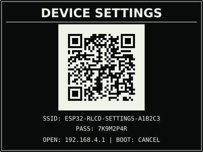
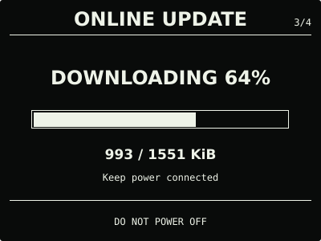

# ESP32 RLCD Firmware

面向 Waveshare ESP32-S3-RLCD-4.2 的原生 ESP-IDF 固件。它以离线可用的 RTC 时钟为
核心，提供月历、环境信息、网络校时、音频诊断和安全的双槽固件更新。

| 项目 | 说明 |
| --- | --- |
| 最新正式版 | [v0.11.0](https://github.com/taifuer/esp32-rlcd-firmware/releases/latest) |
| 兼容硬件 | Waveshare ESP32-S3-RLCD-4.2 |
| 开发框架 | ESP-IDF v5.5.3 |
| 固件服务 | [mcu.taifua.com](https://mcu.taifua.com/) |

## 效果预览

以下界面反映 v0.11.0 正式版。

| 首屏 | 月历 |
| :---: | :---: |
|  |  |
| 状态 | 音频 |
|  |  |
| 设置 | 设置门户 |
|  |  |
| 在线更新 | 更新进度 |
|  |  |

效果图均为 400 × 300 黑底白字；全反射屏的实际观感会随环境光变化。

## 当前功能

- 三段式首屏显示公历、农历、星期、温湿度、电量和网络结果；`NORMAL` 等大显示
  `HH:MM:SS`，`SAVING` 显示 `HH:MM`；
- PCF85063 RTC、SHTC3、GPIO4 电池采样和 8 MB Octal PSRAM；
- 首次启动使用临时 WPA2 热点配网，凭据保存在 NVS，随后自动 SNTP 校时；
- 网络不可用时继续使用 RTC、月历、传感器、按键和音频；`NORMAL` 后台退避重试，
  `SAVING` 保持离线；
- ES8311 与 ES7210 本机音频诊断，最多临时采集并回放 5 秒语音，不持久化或上传；
- 四页系统中心依次为状态、音频、设置和在线更新，低频维护不再占用独立页面；
- 设置门户支持省电模式、时区、温度单位、播放音量、更新通道、手机校时、清除 Wi-Fi 和
  本地 OTA；
- `NORMAL` 保持 `HH:MM:SS` 与自动联网；`SAVING` 隐藏秒数、降低刷新和采样频率，并关闭
  自动校时与自动更新检查，所有手动功能仍可使用；
- 在线更新通过 HTTPS 检查清单并下载 OTA 镜像，安装始终需要实体按键确认；
- 本地更新通过设置门户上传 OTA 镜像，作为无互联网时的维护与恢复入口；
- 双 OTA 应用槽、镜像校验、新版本启动确认和失败回滚，普通更新保留 Wi-Fi 配置。

`NORMAL` 自动校时完成后只在后台检查是否有更新，不会弹出页面、静默安装或打断日常功能。
“在线更新”页按住 `KEY` 2 秒检查；发现新版本后再次按住 2 秒进入 `REVIEW`，确认页再按住
3 秒才安装。正式固件默认只检查稳定版；开发者可在“设置”门户主动加入测试通道。完整说明见
[界面与按键](docs/home-screen.md)和[固件安装与更新](docs/firmware-update.md)。

已安装 v0.10.0 的设备可直接从“在线更新”页升级；v0.7.0—v0.9.0 可通过原有本地更新
入口上传 v0.11.0 OTA 固件，v0.6.0 及更早版本需使用 Factory 固件完整安装。

## 安装使用

普通用户无需安装 ESP-IDF。首次安装、从 v0.6.0 或更早版本迁移以及故障恢复使用 Release
中的 `-factory.bin`；已安装 v0.7.0 或更新版本后可使用 `-ota.bin`。v0.11.0 的离线更新
位于“设置”门户。下载、校验、Windows、Linux 和 macOS 的完整步骤见
[发布固件安装指南](docs/user-install.md)。

Windows + WSL 的首次安装示例：

```bash
cd dist/v0.11.0
sha256sum --check SHA256SUMS
cd ../..
./scripts/flash.sh --port COM5 \
  --firmware dist/v0.11.0/esp32-rlcd-firmware-v0.11.0-factory.bin \
  --confirm
```

写入后物理关机，不按 `BOOT` 正常开机，再按屏幕完成 2.4 GHz Wi-Fi 配置。无网络时可
执行 `./scripts/set-rtc.sh --port COM5` 手动校时。

> PCF85063 由独立的 `RTC_BAT` 接口维持走时，不使用 18650 主电池。若需要彻底断电后
> 继续走时，请按微雪规格连接 PH1.0 可充电 RTC 电池，不要使用不可充电 CR1220。

## 开发

### 项目结构

```text
.
├── src/                 # ESP-IDF 组件与项目源码
│   ├── app/             # 应用入口、页面状态与 USB 命令
│   ├── audio/           # 扬声器、双麦克风与音频诊断
│   ├── board/           # 板级总线和引脚
│   ├── calendar/        # 公历月份与农历换算
│   ├── display/         # ST7305 界面
│   ├── network/         # 配网、NVS、SNTP 与联网会话
│   ├── rtc/             # PCF85063 与备用电池保持判定
│   ├── settings/        # 持久化偏好、输入校验与省电策略
│   └── update/          # 在线更新、设置门户、本地 OTA 与双槽回滚
├── tests/               # 主机端纯逻辑测试
├── scripts/             # 依赖、测试、构建、烧录与发布脚本
├── docs/                # 使用、设计与开发文档
├── dist/                # 实机验证后的正式固件
└── LICENSES/            # 第三方许可文本
```

### 本地构建

```bash
./scripts/bootstrap.sh
./scripts/bootstrap.sh --check
./scripts/check-repository.sh
./scripts/check-licenses.sh
./scripts/test.sh
./scripts/build.sh
```

依赖版本由 [`tool-versions.env`](tool-versions.env) 固定，工具链和第三方源码保存在仓库
之外。开发版/正式版通道、实机验收和发布流程见
[开发与发布指南](docs/development.md)，烧录步骤见[开发烧录流程](docs/flashing.md)。

## 文档

- [发布固件安装指南](docs/user-install.md)：下载、校验、首次安装与故障排查；
- [固件安装与更新](docs/firmware-update.md)：在线更新、设置门户本地 OTA、双槽与失败恢复；
- [自动配网与网络校时](docs/network-time.md)：配网、NVS、SNTP 与离线行为；
- [界面与按键](docs/home-screen.md)：首屏、月历、系统中心和实体按键；
- [产品界面与交互设计规范](docs/design-guidelines.md)：信息架构、视觉与交互原则；
- [开发计划](docs/roadmap.md)：已经确定的后续版本范围与验收边界；
- [开发与发布指南](docs/development.md)：依赖、版本、测试和 Release 流程；
- [实机验证记录](docs/bringup-log.md)：已完成的硬件验收结果；
- [版本变更记录](CHANGELOG.md)：各正式版本的功能变化。

## 参考资料

- [微雪产品文档](https://docs.waveshare.net/ESP32-S3-RLCD-4.2/)与
  [官方示例仓库](https://github.com/waveshareteam/ESP32-S3-RLCD-4.2)；
- [ESP-IDF v5.5.3 编程指南](https://docs.espressif.com/projects/esp-idf/en/v5.5.3/esp32s3/)、
  [OTA API](https://docs.espressif.com/projects/esp-idf/en/v5.5.3/esp32s3/api-reference/system/ota.html)
  与 [HTTP Client](https://docs.espressif.com/projects/esp-idf/en/v5.5.3/esp32s3/api-reference/protocols/esp_http_client.html)；
- [U8g2](https://github.com/olikraus/u8g2)、
  [Espressif QR Code](https://components.espressif.com/components/espressif/qrcode/versions/0.2.0/readme)、
  [esp_codec_dev](https://github.com/espressif/esp-adf/tree/9b35bca1a6db3d989936f228d6e28f33089fa9e7/components/esp_codec_dev)
  与[小智 ESP32 的本板音频实现](https://github.com/ZhouhaoJiang/xiaozhi-esp32/tree/main/main/boards/waveshare-s3-rlcd-4.2)；
- [PCF85063A 数据手册](https://www.nxp.com/docs/en/data-sheet/PCF85063A.pdf)与
  [SHTC3 产品资料](https://sensirion.com/products/catalog/SHTC3)，农历换算以
  [香港天文台对照表](https://www.hko.gov.hk/sc/gts/time/conversion.htm)校验。

## 许可证与第三方声明

本项目采用 [Apache License 2.0](LICENSE)。第三方组件和字体的固定版本、版权归属与许可
文本见 [`NOTICE.md`](NOTICE.md) 和 [`LICENSES/`](LICENSES/)。
