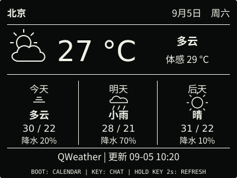
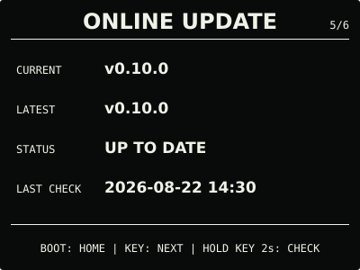

# ESP32 RLCD Firmware

面向 Waveshare ESP32-S3-RLCD-4.2 的原生 ESP-IDF 固件。它以离线可用的 RTC 时钟为
核心，提供月历、环境信息、microSD 图片、离线语音指令、AI 对话、联网天气、网络校时
和安全的双槽固件更新。

| 项目 | 说明 |
| --- | --- |
| 最新正式版 | [v0.25.0](https://github.com/taifuer/esp32-rlcd-firmware/releases/latest) |
| 兼容硬件 | Waveshare ESP32-S3-RLCD-4.2 |
| 开发框架 | ESP-IDF v5.5.3 |
| 固件服务 | [mcu.taifua.com](https://mcu.taifua.com/) |

## 效果预览

以下为 v0.25.0 的界面示意。

| 首屏 | 天气 |
| :---: | :---: |
|  |  |
| 月历 | microSD 图片 |
|  |  |
| 状态 | 对话 |
|  |  |
| 设置 | 在线更新 |
|  |  |

效果图均为 400 × 300 黑底白字；全反射屏的实际观感会随环境光变化。

## 当前功能

- 三段式首屏显示公历、农历、星期、温湿度、三态环境舒适度、电量和网络结果；`NORMAL`
  等大显示 `HH:MM:SS`，`SAVING` 显示 `HH:MM`；
- PCF85063 RTC、SHTC3、GPIO4 电池采样和 8 MB Octal PSRAM；
- 首次启动使用临时 WPA2 热点配网，凭据保存在 NVS，随后自动 SNTP 校时；
- 网络不可用时继续使用 RTC、月历、传感器、按键和离线语音；`NORMAL` 保持家庭 Wi-Fi
  连接并在断线后后台退避重试，`SAVING` 空闲时保持离线；
- 可选的[天气 Beta](docs/weather.md)使用用户自己的 QWeather API Host 和 API Key；
  设置门户按“省份 → 城市”配置地点，设备直连 QWeather 获取实时天气和
  三日预报并缓存。功能启用后即加入 `BOOT` 页面环，保存配置后会打开天气页；请求中和
  失败原因都在固定天气布局内显示，同地点已有缓存时后台刷新失败仍继续显示缓存，
  顶栏单独显示 RTC 当前日期和星期；按住 `KEY` 2 秒可手动刷新，`SAVING` 不为天气周期
  联网；
- 离线语音使用板载 ES7210 和 ESP-SR 中文模型：“对话”页显示
  `OFFLINE COMMANDS` 和 `Hold KEY 2s for a command`，按住 `KEY` 2 秒并松开后，
  可用“回到主页”“打开日历”“查看状态”“打开图片”“打开设置”等安全指令导航；
  不使用唤醒词，离线会话的原始音频不持久化、不上传；
- 可选的[AI 对话 Beta](docs/cloud-voice.md)使用用户自己的阿里云百炼 API Key：空闲页显示
  `AI CHAT` 和 `Hold KEY 2s to ask`；设备在线
  且处于 `NORMAL` 时，在同一 WebSocket 会话中支持最多 5 轮中英文问答；每轮仍由按键
  明确开始，续问等待 30 秒，新一轮可在会话开始后的 5 分钟内发起；已经开始的回答会
  完整结束。回答默认简短，回复文字会跟随本地播放进度滚动显示最新 4 行。停用、离线、
  省电或未配置时自动使用本地 MultiNet；默认模型为 `qwen3-omni-flash-realtime`，无需创建百炼应用或填写
  Workspace ID、App ID，也不使用唤醒词或后台监听；
- 四页系统中心依次为状态、对话、设置和在线更新；页脚直接写出下一目的地或动作，
  不再用泛化的“下一页”“系统”或“门户”代替用户目标；
- “设置”页支持手动提前省电；设置门户支持时区、温度单位、播放音量、单个每周闹钟、
  更新通道、手机校时、已保存 Wi-Fi 查看、安全更换与独立清除、天气、microSD 图片管理
  和本地 OTA；
- 离线闹钟按 RTC 本地时间触发；到点播放提示音并显示大字提醒，支持停止、首次延后
  5 分钟和 60 秒自动停止，断网及 `SAVING` 模式不影响已保存规则；
- `NORMAL` 保持 `HH:MM:SS` 和家庭 Wi-Fi 连接，并使用 ESP-IDF `WIFI_PS_MIN_MODEM`
  降低关联空闲功耗；`SAVING` 隐藏秒数、降低刷新和采样频率，并关闭自动校时与自动更新
  检查，需要网络的手动功能仍可临时连接；
- 在线更新通过 HTTPS 检查清单并下载 OTA 镜像，安装始终需要实体按键确认；
- 本地更新通过设置门户上传 OTA 镜像，作为无互联网时的维护与恢复入口；
- 双 OTA 应用槽、镜像校验、新版本启动确认和失败回滚，普通更新保留 Wi-Fi 配置；
- 开机按住 `KEY` 可进入启动恢复模式，只保留在线更新与精简设置门户；连续异常启动时
  也可自动进入，操作说明见[固件安装与更新](docs/firmware-update.md#应用启动恢复)；
- 通过板载 1-bit SDMMC 显示 FAT32 microSD 中最多 32 张黑白图片；多图时短按 `KEY`
  手动切换并跨重启保留选择，不自动轮播；
- 手机浏览器可在本地将 JPEG/PNG 转换并导入 microSD，也可安装公共演示图集，逐张预览、
  选择和确认删除；图片页长按 `KEY` 2 秒后还可通过独立确认删除当前图片；无卡或图片
  无效时自然隐藏相关功能，不影响其他本地能力。

`NORMAL` 自动校时完成后保持 Wi-Fi 连接，只在后台检查是否有更新，不会弹出页面、静默安装
或打断日常功能。
“在线更新”页按住 `KEY` 2 秒检查；发现新版本后再次按住 2 秒进入 `REVIEW`，确认页再按住
3 秒才安装。正式固件默认只检查稳定版；开发者可在“设置”门户主动加入测试通道。完整说明见
[界面与按键](docs/home-screen.md)和[固件安装与更新](docs/firmware-update.md)。

v0.18.0 首次加入独立语音模型。全新安装和完整恢复使用包含模型的 Factory 固件；
v0.7.0—v0.16.0 若要保留 NVS、Wi-Fi 和设备偏好，应通过 USB 使用 `update-app.sh`
一次写入 OTA 应用与同版本模型。在线更新和设置门户本地 OTA 只更新应用，不能为旧设备
补装模型；已经安装兼容模型后，后续应用 OTA 可以继续复用它。v0.6.0 及更早版本仍需
使用 Factory 固件完整安装。
microSD 的 FAT32、固定目录、图片格式和关机插拔要求见
[microSD 图片准备](docs/microsd-images.md)。

## 安装使用

普通用户无需安装 ESP-IDF。首次安装、从 v0.6.0 或更早版本迁移以及故障恢复使用 Release
中的 `-factory.bin`；已安装 v0.7.0 或更新版本后可使用 `-ota.bin`，但从 v0.16.0 或
更早版本迁移到 v0.25.0 时，若要使用自 v0.18.0 起提供的语音功能，还需同时写入
`-model.bin`。离线更新位于“设置”门户。
下载、校验、Windows、Linux 和 macOS 的完整步骤见
[发布固件安装指南](docs/user-install.md)。

Windows + WSL 的首次安装示例：

```bash
cd dist/v0.25.0
sha256sum --check SHA256SUMS
cd ../..
./scripts/flash.sh --port COM5 \
  --firmware dist/v0.25.0/esp32-rlcd-firmware-v0.25.0-factory.bin \
  --confirm
```

写入后物理关机，不按 `BOOT` 正常开机，再按屏幕完成 2.4 GHz Wi-Fi 配置。无网络时可
执行 `./scripts/set-rtc.sh --port COM5` 手动校时。

> PCF85063 由独立的 `RTC_BAT` 接口维持走时，不使用 18650 主电池。若需要彻底断电后
> 继续走时，请按微雪规格连接 PH1.0 可充电 RTC 电池，不要使用不可充电 CR1220。

## 开发

### 项目结构

```text
.
├── src/                 # ESP-IDF 组件与项目源码
│   ├── alarm/           # 离线闹钟调度、按键门控与触发去重
│   ├── app/             # 应用入口、页面状态与 USB 命令
│   ├── audio/           # 扬声器、双麦克风、音频诊断与离线语音
│   ├── board/           # 板级总线和引脚
│   ├── calendar/        # 公历月份与农历换算
│   ├── conversation/    # 可选 AI 对话配置、多轮会话与安全传输
│   ├── display/         # ST7305 界面
│   ├── gallery/         # 公共演示图清单与 HTTPS 下载
│   ├── image/           # PBM/BMP 单色图片校验与解码
│   ├── network/         # 配网、NVS、SNTP 与联网会话
│   ├── recovery/        # 启动异常记录、恢复模式与 OTA 健康判定
│   ├── rtc/             # PCF85063 与备用电池保持判定
│   ├── sd_image/        # SDMMC/FatFs 扫描、缓存与明确导入事务
│   ├── sensors/         # SHTC3 与环境舒适度判定
│   ├── settings/        # 持久化偏好、输入校验与省电策略
│   ├── storage/         # NVS 持久化存储初始化
│   ├── update/          # 在线更新、设置门户、本地 OTA 与双槽回滚
│   └── weather/         # QWeather 配置、地点解析、天气请求与离线缓存
├── tests/               # 主机端纯逻辑测试
├── scripts/             # 依赖、测试、构建、烧录与发布脚本
├── tools/               # microSD 图片检查与转换工具
├── docs/                # 使用、设计与开发文档
├── dist/                # 实机验证后的正式固件
└── LICENSES/            # 第三方许可文本
```

### 本地构建

```bash
./scripts/bootstrap.sh
./scripts/bootstrap.sh --check
./scripts/check-repository.sh
./scripts/check-licenses.sh
./scripts/test.sh
./scripts/build.sh
```

依赖版本由 [`tool-versions.env`](tool-versions.env) 固定，工具链和第三方源码保存在仓库
之外。开发版/正式版通道、实机验收和发布流程见
[开发与发布指南](docs/development.md)，烧录步骤见[开发烧录流程](docs/flashing.md)。

## 文档

- [发布固件安装指南](docs/user-install.md)：下载、校验、首次安装与故障排查；
- [固件安装与更新](docs/firmware-update.md)：在线更新、设置门户本地 OTA、双槽与失败恢复；
- [自动配网与网络校时](docs/network-time.md)：配网、NVS、SNTP 与离线行为；
- [界面与按键](docs/home-screen.md)：首屏、月历、条件图片页、系统中心和实体按键；
- [AI 对话 Beta](docs/cloud-voice.md)：API Key 获取、多轮交互、离线回退、
  数据与费用边界；
- [天气 Beta](docs/weather.md)：QWeather 凭据、级联选址、刷新、离线缓存和费用边界；
- [microSD 图片准备](docs/microsd-images.md)：FAT32、固定目录、图片格式、导入与管理边界；
- [产品界面与交互设计规范](docs/design-guidelines.md)：信息架构、视觉与交互原则；
- [开发计划](docs/roadmap.md)：已经确定的后续版本范围与验收边界；
- [开发与发布指南](docs/development.md)：依赖、版本、测试和 Release 流程；
- [实机验证记录](docs/bringup-log.md)：已完成的硬件验收结果；
- [版本变更记录](CHANGELOG.md)：各版本的功能变化。

## 参考资料

- [微雪产品文档](https://docs.waveshare.net/ESP32-S3-RLCD-4.2/)与
  [官方示例仓库](https://github.com/waveshareteam/ESP32-S3-RLCD-4.2)；
- [ESP-IDF v5.5.3 编程指南](https://docs.espressif.com/projects/esp-idf/en/v5.5.3/esp32s3/)、
  [OTA API](https://docs.espressif.com/projects/esp-idf/en/v5.5.3/esp32s3/api-reference/system/ota.html)
  与 [HTTP Client](https://docs.espressif.com/projects/esp-idf/en/v5.5.3/esp32s3/api-reference/protocols/esp_http_client.html)；
- [ESP-SR Speech Command Recognition](https://docs.espressif.com/projects/esp-sr/en/latest/esp32s3/speech_command_recognition/README.html)
  与 [Flash Model](https://docs.espressif.com/projects/esp-sr/en/latest/esp32s3/flash_model/README.html)；
- [U8g2](https://github.com/olikraus/u8g2)、
  [Espressif QR Code](https://components.espressif.com/components/espressif/qrcode/versions/0.2.0/readme)、
  [esp_codec_dev](https://github.com/espressif/esp-adf/tree/9b35bca1a6db3d989936f228d6e28f33089fa9e7/components/esp_codec_dev)
  与[小智 ESP32 的本板音频实现](https://github.com/ZhouhaoJiang/xiaozhi-esp32/tree/main/main/boards/waveshare-s3-rlcd-4.2)；
- [PCF85063A 数据手册](https://www.nxp.com/docs/en/data-sheet/PCF85063A.pdf)与
  [SHTC3 产品资料](https://sensirion.com/products/catalog/SHTC3)，农历换算以
  [香港天文台对照表](https://www.hko.gov.hk/sc/gts/time/conversion.htm)校验。

## 许可证与第三方声明

本项目采用 [Apache License 2.0](LICENSE)。第三方组件和字体的固定版本、版权归属与许可
文本见 [`NOTICE.md`](NOTICE.md) 和 [`LICENSES/`](LICENSES/)。
