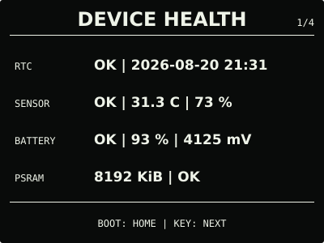
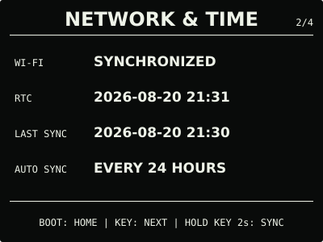

# ESP32 RLCD Firmware

面向微雪 ESP32-S3-RLCD-4.2 开发板的原生 ESP-IDF 固件，提供日常信息仪表盘、
月历、本地 Wi-Fi 配网和自动网络校时。

> 本项目是独立的社区固件，与 Espressif Systems、Waveshare 及相关上游项目不存在
> 隶属、赞助或官方背书关系。产品名和商标仅用于说明兼容硬件与依赖来源。

## 效果预览

| 首屏 | 月历 |
| :---: | :---: |
|  |  |
| 设备健康 | 网络与时间 |
|  |  |
| 音频诊断 | Wi-Fi 维护 |
|  |  |
| 关于与更新 | 本地升级入口 |
|  |  |

效果图均为 400 × 300 黑底白字；全反射屏的实际观感会随环境光变化。

## 项目概况

| 项目 | 说明 |
| --- | --- |
| 最新版本 | [v0.8.0](https://github.com/taifuer/esp32-rlcd-firmware/releases/latest) |
| 兼容硬件 | Waveshare ESP32-S3-RLCD-4.2 |
| 开发框架 | ESP-IDF v5.5.3 |
| 发布方式 | GitHub Releases 保留最新固件，`dist/` 保存各正式版本 |

## 当前功能

- 三段式首屏：公历日期、农历、星期、时间、温湿度、电量和 Wi-Fi 状态；
- `HH:MM:SS` 等大显示，适配 400 × 300 ST7305 黑底白字界面；
- 支持 PCF85063 RTC、SHTC3 温湿度、GPIO4 电池采样和 8 MB Octal PSRAM；
- 设备健康页在网络启动前检查 RTC 停振标志，并在一次真实断电后显示备用电池保持状态；
- 首次启动提供 WPA2 临时热点、配网页面和 Wi-Fi 加入二维码；
- Wi-Fi 凭据保存在 NVS，断电重启后可自动联网并通过 SNTP 恢复时间；
- 校时成功后关闭 Wi-Fi，每 24 小时重新同步；
- `BOOT` 用于首屏与当月月历，`KEY` 用于设备健康、网络与时间、音频、Wi-Fi 维护、关于与更新；
- 系统中心按职责分开硬件、联网校时、音频诊断、重新配网和版本更新，次级页面 30 秒后返回首屏；
- “网络与时间”页长按 `KEY` 2 秒可立即校时，“Wi-Fi 维护”页长按 5 秒才会清除网络配置；
- “音频”页显示 ES8311 扬声器和 ES7210 双麦克风状态；长按 `KEY` 2 秒可播放两声提示
  音、临时采集最多 5 秒语音并自动回放信号更强的一路，录音只存在 PSRAM 且用后即清；
- “关于与更新”页显示固件与 ESP-IDF 版本；长按 `KEY` 3 秒开启随机密码保护的本地升级
  热点，可在浏览器上传 OTA 固件并查看屏幕实时进度；
- 双 OTA 应用槽在镜像完整校验后才切换，支持新版本启动确认和失败回滚；正常升级保留
  NVS 中的 Wi-Fi 配置；
- USB 命令支持查询状态、手动校时和重置网络配置。

暂未提供联网天气、语音助手和蓝牙；当前音频功能仅用于本机硬件诊断与临时回放，不保存
录音，也不把声音发送到网络。
界面、联网与升级行为的详细说明见
[界面与按键](docs/home-screen.md)、[自动配网与网络校时](docs/network-time.md)和
[固件安装与本地升级](docs/firmware-update.md)。

## 安装使用

普通用户无需安装 ESP-IDF。从 v0.6.0 或更早版本迁移、首次安装和故障恢复使用 Release
中的 `-factory.bin`；已经安装 v0.7.0 或更新版本后，日常升级使用 `-ota.bin` 和设备本地
网页。以下为已验证的 Windows + WSL 首次安装流程，示例端口为 `COM5`；其他平台、OTA、
完整校验步骤和故障排查见[发布固件安装指南](docs/user-install.md)。

1. 保持 Type-C 连接，长按 `PWR` 关机；按住 `BOOT`，短按 `PWR`，约 2 秒后松开
   `BOOT`。
2. 在仓库根目录执行：

   ```bash
   cd dist/v0.8.0
   sha256sum --check SHA256SUMS
   cd ../..
   ./scripts/flash.sh --port COM5 \
     --firmware dist/v0.8.0/esp32-rlcd-firmware-v0.8.0-factory.bin \
     --confirm
   ```

3. 出现 `Hash of data verified.` 后，长按 `PWR` 关机；不要按 `BOOT`，短按 `PWR`
   正常启动。
4. 扫描屏幕二维码加入临时热点，填写家庭 2.4 GHz Wi-Fi；无法自动打开配网页面时访问
   `http://192.168.4.1`。

网络不可用时，可通过 USB 执行 `./scripts/set-rtc.sh --port COM5` 手动校时。

> PCF85063 由独立的 `RTC_BAT` 接口维持走时，不使用 18650 主电池。若需要彻底断电后
> 继续走时，请按微雪规格连接 PH1.0 可充电 RTC 电池，不要使用不可充电 CR1220。

## 开发

### 项目结构

```text
.
├── .github/             # GitHub Actions 自动检查
├── src/                 # ESP-IDF 组件与项目源码
│   ├── app/             # 应用入口与 USB 命令
│   ├── audio/           # 扬声器、双麦克风与音频诊断
│   ├── audio_codec/     # 外部 codec 源码的最小 ESP-IDF 构建适配
│   ├── board/           # 板级总线和引脚
│   ├── calendar/        # 公历月份与农历换算
│   ├── display/         # ST7305 界面
│   ├── input/           # BOOT、KEY 驱动与按键状态机
│   ├── network/         # 配网、NVS 与 SNTP
│   ├── power/           # 电池采样与估算
│   ├── rtc/             # PCF85063 与备用电池保持判定
│   ├── sensors/         # SHTC3 驱动
│   ├── storage/         # 项目持久化存储初始化
│   └── update/          # 双分区 OTA 与本地升级服务
├── tests/               # 主机端逻辑测试
├── scripts/             # 准备、测试、构建、烧录与校时脚本
├── docs/                # 使用、设计与开发文档
├── dist/                # 实机验证后的正式固件
└── LICENSES/            # 第三方许可文本
```

### 本地构建

```bash
./scripts/bootstrap.sh
./scripts/bootstrap.sh --check
./scripts/check-repository.sh
./scripts/test.sh
./scripts/build.sh
```

依赖版本由 [`tool-versions.env`](tool-versions.env) 固定，并保存在 Git 仓库之外。
配置、构建产物、烧录和发布流程见[开发与发布指南](docs/development.md)与
[开发烧录指南](docs/flashing.md)。

## 文档

- [发布固件安装指南](docs/user-install.md)：下载、校验、烧录、首次配网和故障排查；
- [自动配网与网络校时](docs/network-time.md)：热点、二维码、NVS、SNTP 与安全边界；
- [固件安装与本地升级](docs/firmware-update.md)：Factory/OTA 文件、本地升级与失败恢复；
- [界面与按键](docs/home-screen.md)：首屏、月历、系统中心和实体按键行为；
- [产品界面与交互设计规范](docs/design-guidelines.md)：信息架构、视觉风格与交互原则；
- [开发与发布指南](docs/development.md)：依赖、测试、版本和 Release 流程；
- [实机验证记录](docs/bringup-log.md)：硬件事实、构建哈希和验收结果；
- [版本变更记录](CHANGELOG.md)：各正式版本的功能变化。

贡献代码或报告安全问题前，请阅读[贡献指南](CONTRIBUTING.md)和[安全策略](SECURITY.md)。

## 参考资料

- [微雪产品文档](https://docs.waveshare.net/ESP32-S3-RLCD-4.2/)、
  [官方示例仓库](https://github.com/waveshareteam/ESP32-S3-RLCD-4.2)与
  [RLCD 外设教程](https://docs.waveshare.net/ESP32-Peripheral-Tutorials/Display/RLCD/)；
- [ESP-IDF v5.5.3 编程指南](https://docs.espressif.com/projects/esp-idf/en/v5.5.3/esp32s3/)
  与 [esptool 文档](https://docs.espressif.com/projects/esptool/en/latest/esp32s3/)；
- [U8g2](https://github.com/olikraus/u8g2)、
  [Espressif QR Code](https://components.espressif.com/components/espressif/qrcode/versions/0.2.0/readme)、
  [Espressif esp_codec_dev](https://github.com/espressif/esp-adf/tree/9b35bca1a6db3d989936f228d6e28f33089fa9e7/components/esp_codec_dev)
  与 [小智 ESP32 的本板音频实现](https://github.com/ZhouhaoJiang/xiaozhi-esp32/tree/main/main/boards/waveshare-s3-rlcd-4.2)；
- [ZXing Wi-Fi 二维码格式](https://github.com/zxing/zxing/wiki/Barcode-Contents#wi-fi-network-config-android-ios-11)；
- [PCF85063A 数据手册](https://www.nxp.com/docs/en/data-sheet/PCF85063A.pdf)、
  [SHTC3 产品资料](https://sensirion.com/products/catalog/SHTC3)与
  [香港天文台公历与农历对照表](https://www.hko.gov.hk/sc/gts/time/conversion.htm)。

## 许可证与第三方声明

本项目采用 [Apache License 2.0](LICENSE)。第三方组件和字体遵循各自许可证；固定版本、
版权归属和完整许可文本见 [`NOTICE.md`](NOTICE.md) 与 [`LICENSES/`](LICENSES/)。分发固件时
请一并保留相应许可材料。
