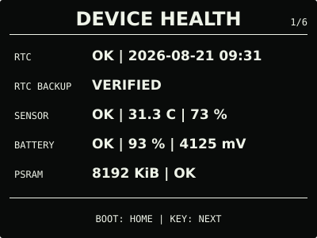
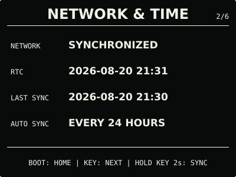
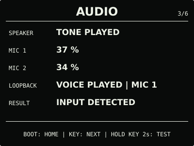
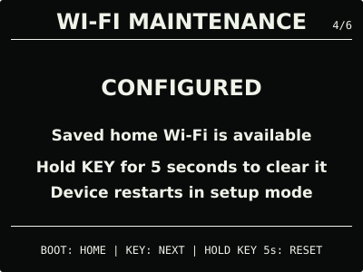
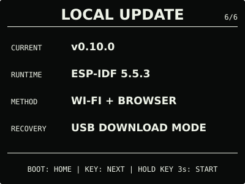
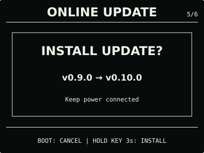
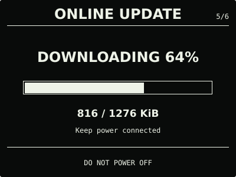
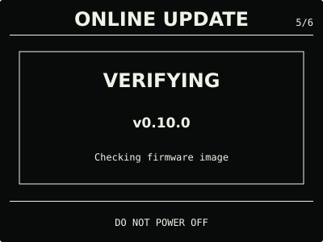
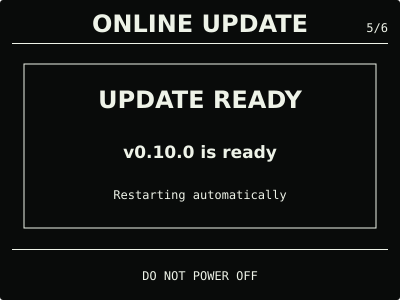

# ESP32 RLCD Firmware v0.10.0

本版本为 Waveshare ESP32-S3-RLCD-4.2 新增需要实体按键确认的 HTTPS 在线更新，同时保留
无需互联网的本地更新、离线 RTC 时钟和全部既有功能。

## 效果预览

| 首屏 | 月历 |
| :---: | :---: |
|  |  |
| 设备健康 | 网络与时间 |
|  |  |
| 音频诊断 | Wi-Fi 维护 |
|  |  |
| 在线更新 | 本地更新 |
|  |  |

在线更新的确认、下载、校验和完成状态：

| 确认 | 下载 |
| :---: | :---: |
|  |  |
| 校验 | 完成 |
|  |  |

效果图按 400 × 300 实机布局和代表性数据绘制，采用黑色背景、白色像素；全反射屏的实际
观感会随环境光变化。

## 选择固件

| 文件 | 用途 | 大小 | SHA-256 |
| --- | --- | ---: | --- |
| `esp32-rlcd-firmware-v0.10.0-factory.bin` | 首次安装、v0.6.0 及更早版本迁移、故障恢复 | 1,634,304 bytes | `ad699baf4e774709c3411eb68fc427a2f12021a5c7345ae29bc5f51d6d6e8024` |
| `esp32-rlcd-firmware-v0.10.0-ota.bin` | 已安装 v0.7.0+ 后的日常更新 | 1,568,768 bytes | `27357fccc04d836dcdbaac86e9d888b83cf039586d798c88da69531c195452b0` |

Factory 镜像从 `0x0` 写入，包含 Bootloader、分区表和应用，并会清除 NVS；OTA 镜像只
包含应用，可通过在线更新、本地更新或串行应用更新写入，并保留家庭 Wi-Fi。两种文件不能
互换。

## 本版本功能

- 系统中心新增 `ONLINE UPDATE`，通过 HTTPS 检查、下载并校验对应通道的 OTA 镜像；
- 自动联网只记录更新结果，不弹出页面、不下载且不静默安装；
- 发现新版本后需再次进入 `REVIEW`，并按住实体 `KEY` 3 秒确认安装；
- 清单、下载地址、项目、硬件、版本、大小、应用描述和 SHA-256 全部匹配后才切换启动槽；
- 原更新入口调整为独立的 `LOCAL UPDATE`，无互联网时仍可通过临时热点上传 OTA 镜像；
- 保留离线 RTC 时钟、月历、温湿度、电量、网络校时、音频诊断和 Wi-Fi 维护功能。

`0.10.0-dev → 0.10.0-rc.1` 的在线检查、确认、下载、校验、重启和 NVS/Wi-Fi 保留路径
已完成实机验收。重定向、错误证书、错误摘要、传输中断、降级和故意断电回滚等错误边界
没有在实机强制触发，由主机逻辑测试、镜像校验和双槽 Bootloader 策略覆盖。

## 安装使用

v0.9.0 及更早版本没有在线更新客户端。已安装 v0.7.0—v0.9.0 时，下载本版本
`-ota.bin`，从原“关于与更新”页开启本地更新并上传；首次安装、v0.6.0 及更早版本迁移
或故障恢复时使用 Factory 镜像：

```bash
cd dist/v0.10.0
sha256sum --check SHA256SUMS
cd ../..
./scripts/flash.sh --port COM5 \
  --firmware dist/v0.10.0/esp32-rlcd-firmware-v0.10.0-factory.bin \
  --confirm
```

设备运行 v0.10.0 后，后续正式版本可从 `ONLINE UPDATE` 获取；无互联网时继续使用
`LOCAL UPDATE`。完整步骤见[发布固件安装指南](../../docs/user-install.md)与
[固件安装与更新](../../docs/firmware-update.md)。本版本使用 ESP-IDF v5.5.3
（`2c211b236707889e8400c4dc5644dd5c4ee071e0`）构建，日期为 2026-08-22；实机记录见
[实机验证记录](../../docs/bringup-log.md)。许可证与第三方声明见
[`LICENSE`](../../LICENSE)、[`NOTICE.md`](../../NOTICE.md) 和 [`LICENSES/`](../../LICENSES/)。
