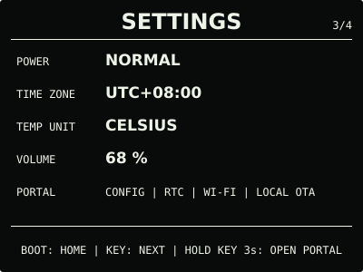
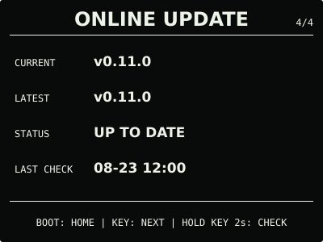

# ESP32 RLCD Firmware v0.11.0

本版本新增统一设置中心、持久化设备偏好和省电模式，并将 Wi-Fi 维护与本地 OTA 收纳到
同一个设置门户。日常页面、离线 RTC 时钟和需要实体按键确认的在线更新保持不变。

## 效果预览

| 首屏 | 月历 |
| :---: | :---: |
|  |  |
| 状态 | 音频 |
|  |  |
| 设置 | 设置门户 |
|  |  |
| 在线更新 | 更新进度 |
|  |  |

效果图按 400 × 300 实机布局和代表性数据绘制，采用黑色背景、白色像素；全反射屏的实际
观感会随环境光变化。

## 选择固件

| 文件 | 用途 | 大小 | SHA-256 |
| --- | --- | ---: | --- |
| `esp32-rlcd-firmware-v0.11.0-factory.bin` | 首次安装、v0.6.0 及更早版本迁移、故障恢复 | 1,653,680 bytes | `dc71b66b9aeb1d56e68a742e170bfde8d91d56406caf804fe4d50d42e1be4d38` |
| `esp32-rlcd-firmware-v0.11.0-ota.bin` | 已安装 v0.7.0+ 后的日常更新 | 1,588,144 bytes | `31e6dc6c87c36798fa8fc77fe58db6314d51415d19a906eaa846513ad1eca6b2` |

Factory 镜像从 `0x0` 写入，包含 Bootloader、分区表和应用，并会清除 NVS；OTA 镜像只
包含应用，可通过在线更新、设置门户本地 OTA 或串行应用更新写入，并保留 Wi-Fi 与设备
偏好。两种文件不能互换。

## 本版本功能

- 系统中心收敛为“状态 → 音频 → 设置 → 在线更新”四页；
- 设置门户可配置 `NORMAL / SAVING`、UTC 偏移、摄氏/华氏、回放音量和更新通道；
- 设置门户同时提供手机校准 RTC、恢复偏好默认值、清除 Wi-Fi 和本地 OTA；
- `SAVING` 隐藏秒数、降低刷新与采样频率，并停止自动校时和后台更新检查；
- 正式固件默认只检查稳定通道，Beta 测试通道需由开发者主动开启；
- 设置记录使用带 CRC32 和代际编号的双槽保存，单槽损坏时可读取并修复另一槽；
- 门户使用五分钟临时 WPA2 热点、会话令牌和互斥写操作，危险操作分别确认。

`0.11.0-dev.2` 已完成实机验收，用户确认系统页面、实体按键和设置门户功能正常。正式
OTA 与候选 OTA 大小一致，仅 76 bytes 不同：应用描述中的版本、构建时间与 ELF 摘要，
以及由这些元数据引起的镜像校验字节和末尾 SHA-256；其余内容一致。

## 安装使用

已安装 v0.10.0 的设备可直接从 `ONLINE UPDATE` 升级。v0.7.0—v0.9.0 可从原本地更新
入口上传本版本 `-ota.bin`；首次安装、v0.6.0 及更早版本迁移或故障恢复使用 Factory：

```bash
cd dist/v0.11.0
sha256sum --check SHA256SUMS
cd ../..
./scripts/flash.sh --port COM5 \
  --firmware dist/v0.11.0/esp32-rlcd-firmware-v0.11.0-factory.bin \
  --confirm
```

完整步骤见[发布固件安装指南](../../docs/user-install.md)与
[固件安装与更新](../../docs/firmware-update.md)。本版本使用 ESP-IDF v5.5.3
（`2c211b236707889e8400c4dc5644dd5c4ee071e0`）构建，日期为 2026-08-23；实机记录见
[实机验证记录](../../docs/bringup-log.md)。许可证与第三方声明见
[`LICENSE`](../../LICENSE)、[`NOTICE.md`](../../NOTICE.md) 和 [`LICENSES/`](../../LICENSES/)。
