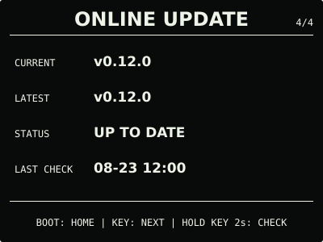

# ESP32 RLCD Firmware v0.12.0

本版新增可选的 microSD 黑白图片页。固件只读扫描 FAT32 存储卡的固定目录；
没有存储卡、目录或有效图片时，时钟、月历和系统中心保持正常。

## 效果预览

| 首屏 | 月历 |
| :---: | :---: |
|  |  |
| microSD 图片 | 状态 |
|  |  |
| 音频 | 设置 |
|  |  |
| 设置门户 | 在线更新 |
|  |  |

效果图按 400 × 300 实机布局和代表性数据绘制，采用黑色背景、白色像素；全反射屏的实际
观感会随环境光变化。

## 选择固件

| 文件 | 用途 | 大小 | SHA-256 |
| --- | --- | ---: | --- |
| `esp32-rlcd-firmware-v0.12.0-factory.bin` | 首次安装、v0.6.0 及更早版本迁移、故障恢复 | 1,719,888 bytes | `737f1b2fec1bd45a95572744b61c7d102688812c4111935931b9733ff4110571` |
| `esp32-rlcd-firmware-v0.12.0-ota.bin` | 已安装 v0.7.0+ 后的日常更新 | 1,654,352 bytes | `9fa60050bceae2c12d093c03221ecf3b179a58a54ea00cbd662d2b75c96c6fad` |

Factory 镜像从 `0x0` 写入，包含 Bootloader、分区表和应用，并会清除 NVS；OTA 镜像只
包含应用，可通过在线更新、设置门户本地 OTA 或串行应用更新写入，并保留 Wi-Fi 与设备
偏好。两种文件不能互换。

## 本版本功能

- 使用板载 1-bit SDMMC 读取 FAT32 microSD，应用层不格式化、修改或删除卡内文件；
- 只扫描 `/rlcd/images/` 中最多 32 个安全文件名，排序后显示第一张完整校验通过的图片；
- 首选 400 × 300 二进制 PBM P4，同时支持受限的未压缩 1-bit 黑白 BMP；
- 底部 50 像素始终由固件覆盖为操作提示，有效图片时 `BOOT` 按“首屏 → 月历 →
  图片 → 首屏”循环；
- 无卡、挂载失败、目录缺失或没有有效图片时隐藏图片页，不弹出全屏错误；
- 新增 `tools/rlcd-image.py`，用于在电脑上检查图片或把 JPEG、PNG 等常见图片转换为
  规范 PBM P4。

`0.12.0-dev.1` 已完成无卡启动、16 GB FAT32 挂载、目录缺失降级和 PBM 图片页
实机验收。用户确认图片方向、黑白极性、底部提示、页面按键和 30 秒返回首屏均正常。
正式 OTA 与该候选 OTA 大小一致，仅 76 bytes 不同，差异全部位于版本、构建时间、
ELF 摘要和镜像校验元数据。

## 安装使用

已安装 v0.10.0 或 v0.11.0 的设备可直接从 `ONLINE UPDATE` 升级。v0.7.0—v0.9.0
可从原本地更新入口上传本版本 `-ota.bin`；首次安装、v0.6.0 及更早版本迁移或故障恢复使用
Factory：

```bash
cd dist/v0.12.0
sha256sum --check SHA256SUMS
cd ../..
./scripts/flash.sh --port COM5 \
  --firmware dist/v0.12.0/esp32-rlcd-firmware-v0.12.0-factory.bin \
  --confirm
```

准备存储卡前请阅读 [microSD 图片准备](../../docs/microsd-images.md)。完整安装步骤见
[发布固件安装指南](../../docs/user-install.md)与[固件安装与更新](../../docs/firmware-update.md)。本版本使用
ESP-IDF v5.5.3（`2c211b236707889e8400c4dc5644dd5c4ee071e0`）构建，日期为 2026-08-23；
实机记录见[实机验证记录](../../docs/bringup-log.md)。许可证与第三方声明见
[`LICENSE`](../../LICENSE)、[`NOTICE.md`](../../NOTICE.md) 和 [`LICENSES/`](../../LICENSES/)。
