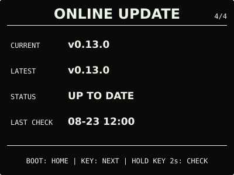

# ESP32 RLCD Firmware v0.13.0

本版把首屏温湿度之间的心形替换为简洁的三态环境舒适度表情，在不增加文字、颜色和
页面的前提下，区分舒适、一般和需调整状态。

## 效果预览

| 首屏 | 月历 |
| :---: | :---: |
|  |  |
| microSD 图片 | 状态 |
|  |  |
| 音频 | 设置 |
|  |  |
| 设置门户 | 在线更新 |
|  |  |

效果图按 400 × 300 实机布局和代表性数据绘制，采用黑色背景、白色像素；全反射屏的实际
观感会随环境光变化。

## 选择固件

| 文件 | 用途 | 大小 | SHA-256 |
| --- | --- | ---: | --- |
| `esp32-rlcd-firmware-v0.13.0-factory.bin` | 首次安装、v0.6.0 及更早版本迁移、故障恢复 | 1,720,624 bytes | `ed6a0b5f946347ba18ccf3d86d7d31140ad22c76c99018b57e1fbd7c56bb025f` |
| `esp32-rlcd-firmware-v0.13.0-ota.bin` | 已安装 v0.7.0+ 后的日常更新 | 1,655,088 bytes | `5505d813565b449fac58f21b30357630bfe31f0520bcdf432679ca65687a885e` |

Factory 镜像从 `0x0` 写入，包含 Bootloader、分区表和应用，并会清除 NVS；OTA 镜像只
包含应用，可通过在线更新、设置门户本地 OTA 或串行应用更新写入，并保留 Wi-Fi 与设备
偏好。两种文件不能互换。

## 本版本功能

- 首屏以相同尺寸的笑脸、平脸和皱脸表示舒适、一般和需调整，不增加永久页面或按键操作；
- 舒适为 20—26 ℃ 且 40—60% RH；一般覆盖 16—28 ℃ 且 30—70% RH 内的其余状态，
  任意一项超出一般范围时提示需调整；
- 使用最近约一分钟的有效读数、边界滞回和变差快于恢复的确认时间，减少临界值附近反复
  切换；无有效或尚未稳定的数据时隐藏表情；
- 判定始终使用摄氏原始值，不受设置门户所选显示温标影响，现有首屏三段布局和实体按键
  语义保持不变。

`0.13.0-dev.1` 已通过开发者测试通道完成在线更新。用户确认首屏显示正常，当前约
31 ℃、73% RH 时按设计显示“需调整”皱脸。正式 OTA 与该候选 OTA 大小一致，仅
76 bytes 不同，差异全部位于版本、构建时间、ELF 摘要和镜像校验元数据。

## 安装使用

已安装 v0.10.0—v0.12.0 的设备可直接从 `ONLINE UPDATE` 升级。v0.7.0—v0.9.0
可从原本地更新入口上传本版本 `-ota.bin`；首次安装、v0.6.0 及更早版本迁移或故障恢复使用
Factory：

```bash
cd dist/v0.13.0
sha256sum --check SHA256SUMS
cd ../..
./scripts/flash.sh --port COM5 \
  --firmware dist/v0.13.0/esp32-rlcd-firmware-v0.13.0-factory.bin \
  --confirm
```

完整步骤见[发布固件安装指南](../../docs/user-install.md)与
[固件安装与更新](../../docs/firmware-update.md)。本版本使用 ESP-IDF v5.5.3
（`2c211b236707889e8400c4dc5644dd5c4ee071e0`）构建，日期为 2026-08-23；实机记录见
[实机验证记录](../../docs/bringup-log.md)。许可证与第三方声明见
[`LICENSE`](../../LICENSE)、[`NOTICE.md`](../../NOTICE.md) 和 [`LICENSES/`](../../LICENSES/)。
