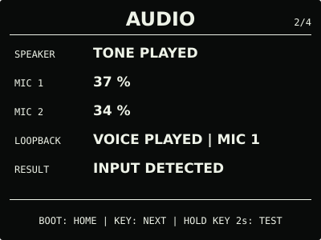
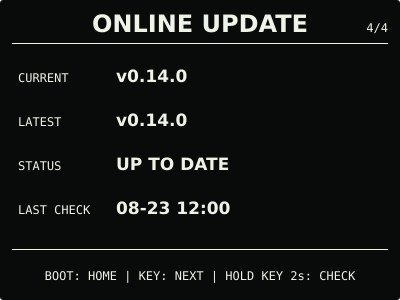

# ESP32 RLCD Firmware v0.14.0

本版新增由 PCF85063 本地时间驱动的单个每周闹钟。规则保存在设备中，断网和省电模式不
影响触发；提醒提供清晰的屏幕状态、提示音、停止和一次 5 分钟延后。

## 效果预览

| 首屏 | 月历 |
| :---: | :---: |
|  |  |
| microSD 图片 | 状态 |
|  |  |
| 音频 | 设置 |
|  |  |
| 闹钟 | 在线更新 |
|  |  |

效果图按 400 × 300 实机布局和代表性数据绘制，采用黑色背景、白色像素；全反射屏的实际
观感会随环境光变化。

## 选择固件

| 文件 | 用途 | 大小 | SHA-256 |
| --- | --- | ---: | --- |
| `esp32-rlcd-firmware-v0.14.0-factory.bin` | 首次安装、v0.6.0 及更早版本迁移、故障恢复 | 1,731,664 bytes | `0a5d2529bc295f8dec63900710a6f5a56dc46cedb6e4599ec18e4412e107f877` |
| `esp32-rlcd-firmware-v0.14.0-ota.bin` | 已安装 v0.7.0+ 后的日常更新 | 1,666,128 bytes | `a651ef871db69ea7bfc053de5433696d0076856167f127efa83df2bc41d68a84` |

Factory 镜像从 `0x0` 写入，包含 Bootloader、分区表和应用，并会清除 NVS；OTA 镜像只
包含应用，可通过在线更新、设置门户本地 OTA 或串行应用更新写入，并保留 Wi-Fi 与设备
偏好。两种文件不能互换。

## 本版本功能

- 设置门户可配置启用状态、`HH:MM` 时间和每周重复日期，新增规则默认关闭；
- `NORMAL`、`SAVING` 与断网状态均按 RTC 本地时间触发，不增加常驻页面或首屏图标；
- 到点显示大字提醒并循环播放三音提示；短按 `BOOT` 停止，首次可短按 `KEY` 延后
  5 分钟，单次最长响铃 60 秒；
- 同一规则同一天不会因重启重复触发，错过目标分钟或物理关机期间不会补发；
- 提示音与音频诊断共用受控音频任务，播放音量为 `0%` 时保持静音。

`0.14.0-dev.1` 已通过开发者测试通道完成在线更新。用户确认闹钟规则保存、到点提醒与
提示音、首次延后 5 分钟和随后停止均有效。正式 OTA 与该候选大小一致，仅 77 bytes 的
版本、构建时间、ELF 摘要和镜像校验元数据不同，运行时代码与配置一致。

## 安装使用

已安装 v0.10.0—v0.13.0 的设备可直接从 `ONLINE UPDATE` 升级。v0.7.0—v0.9.0
可从原本地更新入口上传本版本 `-ota.bin`；首次安装、v0.6.0 及更早版本迁移或故障恢复使用
Factory：

```bash
cd dist/v0.14.0
sha256sum --check SHA256SUMS
cd ../..
./scripts/flash.sh --port COM5 \
  --firmware dist/v0.14.0/esp32-rlcd-firmware-v0.14.0-factory.bin \
  --confirm
```

完整步骤见[发布固件安装指南](../../docs/user-install.md)与
[固件安装与更新](../../docs/firmware-update.md)。本版本使用 ESP-IDF v5.5.3
（`2c211b236707889e8400c4dc5644dd5c4ee071e0`）构建，日期为 2026-08-23；实机记录见
[实机验证记录](../../docs/bringup-log.md)。许可证与第三方声明见
[`LICENSE`](../../LICENSE)、[`NOTICE.md`](../../NOTICE.md) 和 [`LICENSES/`](../../LICENSES/)。
