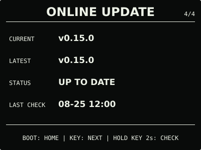

# ESP32 RLCD Firmware v0.15.0

本版完善了可选的 microSD 图片管理。用户可通过设置门户在手机本地转换并导入图片、
安装公共演示图集、手动选择当前图片并安全删除单张图片；最后选择会跨重启保留，相关
操作均无需重启设备。

## 效果预览

| 首屏 | 月历 |
| :---: | :---: |
|  |  |
| microSD 图片 | 状态 |
|  |  |
| 音频 | 设置 |
|  |  |
| 闹钟 | 在线更新 |
|  |  |

效果图按 400 × 300 实机布局和代表性数据绘制，采用黑色背景、白色像素；全反射屏的实际
观感会随环境光变化。

## 选择固件

| 文件 | 用途 | 大小 | SHA-256 |
| --- | --- | ---: | --- |
| `esp32-rlcd-firmware-v0.15.0-factory.bin` | 首次安装、v0.6.0 及更早版本迁移、故障恢复 | 1,772,640 bytes | `793c675729db808dcb5b12d565666adf6bc8a037983246d5bd30bbc0fbe7f3de` |
| `esp32-rlcd-firmware-v0.15.0-ota.bin` | 已安装 v0.7.0+ 后的日常更新 | 1,707,104 bytes | `122f53c1c98bf09e84d7d5dbf957fef6086a44f50529d4c9e1274f651e875021` |

Factory 镜像从 `0x0` 写入，包含 Bootloader、分区表和应用，并会清除 NVS；OTA 镜像只
包含应用，可通过在线更新、设置门户本地 OTA 或串行应用更新写入，并保留 Wi-Fi 与设备
偏好。两种文件不能互换。

## 本版本功能

- 手机浏览器在本地把 JPEG/PNG 适配、二值化并预览为 400 × 300 PBM，确认后才写入
  microSD，原图不会离开手机；
- 用户可按需从 `mcu.taifua.com` 下载并校验 6 张公共演示图；microSD 仍完全可选；
- 多图图片页短按 `KEY` 切换下一张，选择持久保存，不按小时、日期或其他周期自动轮播；
- 设置门户支持逐张预览、设为当前和二次确认删除；导入、选择、删除、普通设置和清除
  Wi-Fi 均不再整机重启，只有固件 OTA 会自动重启。

`0.15.0-dev.4` 已通过开发者测试通道完成在线更新。用户确认屏幕与既有功能正常，多图
切换、重启后保留选择、设置门户预览/选择/删除，以及手机导入和公共演示图正常路径均
符合设计。正式 OTA 与该候选大小一致，仅 77 bytes 的版本、构建时间、ELF 摘要和镜像
校验元数据不同，运行时代码与配置一致。

## 安装使用

v0.10.0—v0.14.0 可从 `ONLINE UPDATE` 直接升级；v0.7.0—v0.9.0 可从原本地更新入口
上传本版本 OTA；首次安装、v0.6.0 及更早版本迁移或故障恢复使用 Factory：

```bash
cd dist/v0.15.0
sha256sum --check SHA256SUMS
cd ../..
./scripts/flash.sh --port COM5 \
  --firmware dist/v0.15.0/esp32-rlcd-firmware-v0.15.0-factory.bin \
  --confirm
```

完整步骤见[发布固件安装指南](../../docs/user-install.md)、
[固件安装与更新](../../docs/firmware-update.md)和
[microSD 图片](../../docs/microsd-images.md)。本版本使用 ESP-IDF v5.5.3
（`2c211b236707889e8400c4dc5644dd5c4ee071e0`）构建，日期为 2026-08-25；实机记录见
[实机验证记录](../../docs/bringup-log.md)。许可证与第三方声明见
[`LICENSE`](../../LICENSE)、[`NOTICE.md`](../../NOTICE.md) 和 [`LICENSES/`](../../LICENSES/)。
