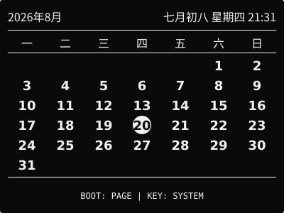
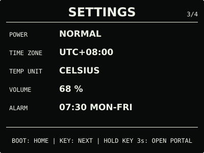
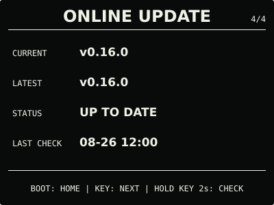

# ESP32 RLCD Firmware v0.16.0

本版为 microSD 图片页增加安全的设备端单张删除。操作需要长按进入确认、完整松开，再次
短按才会真正写卡；删除与设置门户、图库安装共用存储卡互斥边界，完成后无需重启设备。

## 效果预览

| 首屏 | 月历 |
| :---: | :---: |
|  |  |
| microSD 图片 | 删除确认 |
|  |  |
| 音频 | 设置 |
|  |  |
| 闹钟 | 在线更新 |
|  |  |

效果图按 400 × 300 实机布局和代表性数据绘制，采用黑色背景、白色像素；全反射屏的实际
观感会随环境光变化。

## 选择固件

| 文件 | 用途 | 大小 | SHA-256 |
| --- | --- | ---: | --- |
| `esp32-rlcd-firmware-v0.16.0-factory.bin` | 首次安装、v0.6.0 及更早版本迁移、故障恢复 | 1,777,520 bytes | `6322779fda57bccf6d26196c8b02cd891cbf8779b97f75598539944dd0abd4b9` |
| `esp32-rlcd-firmware-v0.16.0-ota.bin` | 已安装 v0.7.0+ 后的日常更新 | 1,711,984 bytes | `a3f3744520592841d61c0bbacacb1f05f94adac9b10687930dca57740fc74671` |

Factory 镜像从 `0x0` 写入，包含 Bootloader、分区表和应用，并会清除 NVS；OTA 镜像只
包含应用，可通过在线更新、设置门户本地 OTA 或串行应用更新写入，并保留 Wi-Fi 与设备
偏好。两种文件不能互换。

## 本版本功能

- 图片页按住 `KEY` 1 秒显示继续按住提示，满 2 秒只进入当前图片的删除确认；
- 进入确认页后必须先完整松开，再短按 `KEY` 才会删除；短按 `BOOT` 或等待 10 秒取消；
- 删除使用目录修订号和精确文件名固定目标，等待期间图片目录改变会安全取消；
- 写卡由异步任务执行，成功后显示相邻图片，删除末张后回到首张，删除唯一图片后隐藏
  图片页；失败时保留原文件、当前图片和运行时目录；
- 删除执行与结果期间屏蔽普通页面导航，操作结束后直接恢复，无需重启设备。

`0.16.0-dev.1` 已通过开发者测试通道从 v0.15.0 完成在线更新。用户确认在线升级与本版
功能未见问题，作为 OTA 和图片删除正常路径的整体冒烟验收。慢卡、只读卡、强制写入失败
和写卡期间触发闹钟未逐项进行破坏性实机验证。

## 安装使用

v0.10.0—v0.15.0 可从 `ONLINE UPDATE` 直接升级到本版，不需要逐版本安装；
v0.7.0—v0.9.0 可从原本地更新入口上传本版 OTA；首次安装、v0.6.0 及更早版本迁移或
故障恢复使用 Factory：

```bash
cd dist/v0.16.0
sha256sum --check SHA256SUMS
cd ../..
./scripts/flash.sh --port COM5 \
  --firmware dist/v0.16.0/esp32-rlcd-firmware-v0.16.0-factory.bin \
  --confirm
```

完整步骤见[发布固件安装指南](../../docs/user-install.md)、
[固件安装与更新](../../docs/firmware-update.md)和
[microSD 图片](../../docs/microsd-images.md)。本版本使用 ESP-IDF v5.5.3
（`2c211b236707889e8400c4dc5644dd5c4ee071e0`）构建，日期为 2026-08-26；实机记录见
[实机验证记录](../../docs/bringup-log.md)。许可证与第三方声明见
[`LICENSE`](../../LICENSE)、[`NOTICE.md`](../../NOTICE.md) 和 [`LICENSES/`](../../LICENSES/)。
