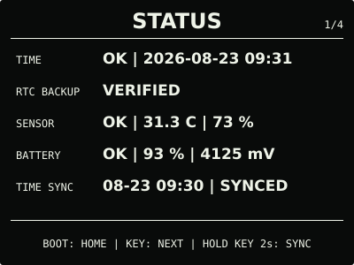
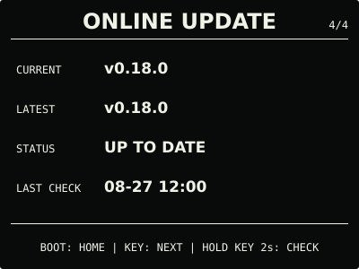

# ESP32 RLCD Firmware v0.18.0

本版新增用户主动发起的中文离线语音，并把低电省电、USB 主机恢复、设备端手动提前省电
等电源规则整合为无需配置的基础体验。离线语音只用于无副作用的页面导航，不依赖网络，
也不会保存或上传原始声音。

## 效果预览

| 首屏 | 月历 |
| :---: | :---: |
|  |  |
| microSD 图片 | 删除确认 |
|  |  |
| 离线语音 | 设置 |
|  |  |
| 状态 | 在线更新 |
|  |  |

效果图按 400 × 300 实机布局和代表性数据绘制，采用黑色背景、白色像素；全反射屏的实际
观感会随环境光变化。

## 选择文件

| 文件 | 用途 | 大小 | SHA-256 |
| --- | --- | ---: | --- |
| `esp32-rlcd-firmware-v0.18.0-factory.bin` | 首次安装、v0.6.0 及更早版本迁移、故障恢复 | 8.56 MB | `121615af71d3fe3ef09e3be03c9e2d8cba8ef4eb4029419026e16f4ae7859489` |
| `esp32-rlcd-firmware-v0.18.0-ota.bin` | 已安装 v0.7.0+ 后的日常应用更新 | 1.93 MB | `67cfeae09efc5bb078e6a806870f9a971fb5c41b8722a7f1cf4ac60fcca3a2e5` |
| `esp32-rlcd-firmware-v0.18.0-model.bin` | 为旧设备通过 USB 补装同版本离线语音模型 | 2.20 MB | `29e156e606a46114b19a3e2f56406bc7045894743ae1e623d0b9e4c5ed1486bf` |

Factory 从 `0x0` 写入，包含 Bootloader、分区表、应用和语音模型，并会清除 NVS。OTA
只包含应用，可用于在线更新或网页本地 OTA，并保留 Wi-Fi 与设备偏好。模型不能独立启动，
也不能上传到设置门户。

从 v0.16.0 等旧正式版仅通过在线更新或网页 OTA 升级时，除语音外的功能可以正常使用；
首次使用离线语音还需通过 `update-app.sh` 一次写入同版本 OTA 与模型，或者完整安装
Factory。USB 应用与模型更新会保留 NVS。

## 本版本变化

- 系统中心调整为“状态 → 语音 → 设置 → 在线更新”；在语音页按住 `KEY` 2 秒并松开后，
  可使用“回到主页”“打开日历”“查看状态”“打开图片”“打开设置”和“取消”等本地指令；
- 低电量自动进入 `SAVING`，使用 20% / 25% 滞回避免频繁切换；电脑 USB 数据主机存在时
  立即恢复 `NORMAL`，设置页可用 `BOOT` 长按 2 秒手动提前进入或取消省电；
- 首屏 Wi-Fi 图标只在家庭 Wi-Fi 已取得 IPv4 时显示；未连接时保持空白；
- 发布布局新增 3 MiB 模型分区、版本化模型附件和保留 NVS 的应用 + 模型 USB 更新流程；
- 原扬声器与双麦克风回环测试保留为开发维护诊断，不再占用日常页面。

本版候选固件已通过固定 USB 流程写入应用与模型，用户实机确认屏幕、Wi-Fi、原有偏好和
中文指令识别正常。正式模型与候选模型逐字节一致；正式 OTA 只在版本、构建和镜像摘要等
元数据处与已验收候选版不同。外部仪表功耗、复杂噪声识别率和缺模型升级降级未做专项
实机验证。

## 安装使用

首次安装、故障恢复或 v0.6.0 及更早版本迁移使用 Factory；已安装 v0.7.0 或更新版本后
可使用 OTA。校验发布文件：

```bash
cd dist/v0.18.0
sha256sum --check SHA256SUMS
```

完整步骤见[发布固件安装指南](../../docs/user-install.md)、
[固件安装与更新](../../docs/firmware-update.md)和
[开发烧录指南](../../docs/flashing.md)。本版本使用 ESP-IDF v5.5.3
（`2c211b236707889e8400c4dc5644dd5c4ee071e0`）构建，日期为 2026-08-27；实机记录见
[实机验证记录](../../docs/bringup-log.md)。许可证与第三方声明见
[`LICENSE`](../../LICENSE)、[`NOTICE.md`](../../NOTICE.md) 和 [`LICENSES/`](../../LICENSES/)。
