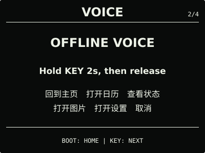
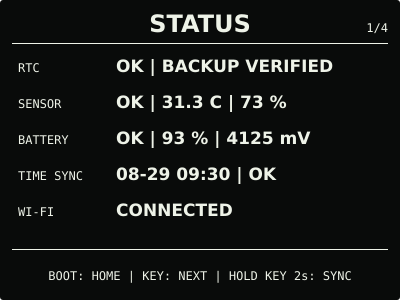
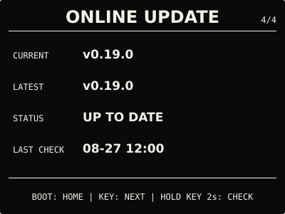

# ESP32 RLCD Firmware v0.19.0

本版完善日常联网和环境数据显示：`NORMAL` 保持家庭 Wi-Fi 连接，设置门户可以查看并
安全更换已保存网络；温湿度读取加入恢复重试、最近有效值和过期边界，避免一次瞬时故障
让首屏数值与三态表情消失。离线时 RTC、日历、传感器、microSD 图片、闹钟和语音仍可
正常使用。

## 效果预览

| 首屏 | 月历 |
| :---: | :---: |
|  |  |
| microSD 图片 | 删除确认 |
|  |  |
| 离线语音 | 设置 |
|  |  |
| 状态 | 在线更新 |
|  |  |

效果图按 400 × 300 实机布局和代表性数据绘制，采用黑色背景、白色像素；全反射屏的实际
观感会随环境光变化。

## 选择文件

| 文件 | 用途 | 大小 | SHA-256 |
| --- | --- | ---: | --- |
| `esp32-rlcd-firmware-v0.19.0-factory.bin` | 首次安装、v0.6.0 及更早版本迁移、故障恢复 | 8.56 MB | `e682ed89373a02c8935a86dd5de47a9d65df7eba310571902a21cdee93f2c8a4` |
| `esp32-rlcd-firmware-v0.19.0-ota.bin` | 已安装 v0.7.0+ 后的日常应用更新 | 1.95 MB | `023b0be722f577724094fe77cc0e64ccabd190d4e4752e8adecbee15d61aa4ce` |
| `esp32-rlcd-firmware-v0.19.0-model.bin` | 为旧设备通过 USB 补装同版本离线语音模型 | 2.20 MB | `29e156e606a46114b19a3e2f56406bc7045894743ae1e623d0b9e4c5ed1486bf` |

Factory 从 `0x0` 写入，包含 Bootloader、分区表、应用和语音模型，并会清除 NVS。OTA
只包含应用，可用于在线更新或设置门户本地 OTA，并保留 Wi-Fi 与设备偏好。模型不能独立
启动，也不能上传到设置门户。

从 v0.16.0 等旧正式版仅通过在线更新升级时，除语音外的功能可以正常使用；首次使用
离线语音还需通过 `update-app.sh` 一次写入同版本 OTA 与模型，或者完整安装 Factory。
已经安装 v0.18.0 兼容模型的设备可以直接使用本版 OTA。

## 本版本变化

- `NORMAL` 取得家庭网络 IPv4 后保持连接，并使用 `WIFI_PS_MIN_MODEM` 降低关联空闲
  功耗；断线在后台退避重试，`SAVING` 仍只为用户主动操作临时联网；
- 首屏 Wi-Fi 图标只表示当前 STA 已取得 IPv4；状态页分别表达当前链路和最近时间同步，
  不再用历史同步结果代替实时连接状态；
- 设置门户显示已保存的 Wi-Fi 名称，并支持先验证、成功后再保存的新网络切换；失败不会
  覆盖旧凭据，成功和失败都不需要重启整机；
- 温湿度首次取得有效样本后立即显示三态表情；读取失败会先恢复重试，仍失败时保留最近
  有效结果并在状态页标记 `STALE`，满 180 秒未恢复后才显示占位符；
- 温湿度日常数值使用近一分钟有效样本中位数，并只在屏幕可见精度变化时刷新；
- 增加易失的语音可靠性诊断和固定采集工具，供开发测试使用，不增加用户页面，也不保存
  或传输原始 PCM。

用户已通过测试通道确认 Wi-Fi、屏幕、离线语音和设置继续正常，并确认 `0.19.0-dev.2`
下温湿度与表情稳定显示。正式 OTA 与该候选长度相同，仅 75 bytes 的版本和构建摘要元数据
不同。Wi-Fi 失败换网、SHTC3 连续故障注入、固定 50 次语音矩阵和外部功耗测量未做本轮
专项实机验证。

## 安装使用

首次安装、故障恢复或 v0.6.0 及更早版本迁移使用 Factory；已安装 v0.7.0 或更新版本后
可使用 OTA。校验发布文件：

```bash
cd dist/v0.19.0
sha256sum --check SHA256SUMS
```

完整步骤见[发布固件安装指南](../../docs/user-install.md)、
[固件安装与更新](../../docs/firmware-update.md)和
[开发烧录指南](../../docs/flashing.md)。本版本使用 ESP-IDF v5.5.3
（`2c211b236707889e8400c4dc5644dd5c4ee071e0`）构建，日期为 2026-08-29；实机记录见
[实机验证记录](../../docs/bringup-log.md)。许可证与第三方声明见
[`LICENSE`](../../LICENSE)、[`NOTICE.md`](../../NOTICE.md) 和 [`LICENSES/`](../../LICENSES/)。
