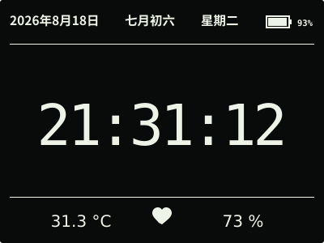

# ESP32 RLCD Firmware v0.2.0

这是由本项目源码及固定开源依赖构建的 v0.2.0 正式发布物，不是对外部或社区完整固件的
改名或重新打包。



> 按 v0.2.0 的 400 × 300 实机布局和验收数据绘制；实物为单色全反射屏，观感会随
> 环境光变化。

| 项目 | 值 |
| --- | --- |
| 文件 | `esp32-rlcd-firmware-v0.2.0.bin` |
| 效果图 | `home-screen.svg` |
| 烧录地址 | `0x0` |
| 大小 | 699,504 bytes |
| SHA-256 | `d034c397aba9f79985bc7c187c24fb8db4e974b6b7ca7c0dcd0b724e1a21e389` |
| 应用镜像 SHA-256 | `cecd4ee4c9a8a403dccbe8b97b3798a7f6922e32d18d121eb2c9955d431f7374` |
| 芯片 | ESP32-S3 |
| Flash | 16 MB |
| ESP-IDF | v5.5.3 (`2c211b236707889e8400c4dc5644dd5c4ee071e0`) |
| 构建日期 | 2026-08-18 |
| 功能与布局实机验收 | 通过 |

本版本包含三段式首屏、等大 `HH:MM:SS`、公历与农历、中文星期、SHTC3 温湿度和
GPIO4 电池电量。PCF85063 RTC、8 MB PSRAM、显示、传感器、电池 ADC、串口校时以及
最终布局均已在实机验收；正式版本构建另行通过完整主机测试和 ESP-IDF 构建。

在仓库根目录执行：

```bash
cd dist/v0.2.0
sha256sum --check SHA256SUMS
cd ../..
./scripts/flash.sh --port COM5 \
  --firmware dist/v0.2.0/esp32-rlcd-firmware-v0.2.0.bin \
  --confirm
```

完整步骤见[发布固件安装指南](../../docs/user-install.md)，验证结果见
[实机验证记录](../../docs/bringup-log.md)。项目许可证、第三方组件和字体的完整声明见
[`LICENSE`](../../LICENSE)、[`NOTICE.md`](../../NOTICE.md) 与
[`LICENSES/`](../../LICENSES/)；再分发此固件时必须同时保留这些材料。
