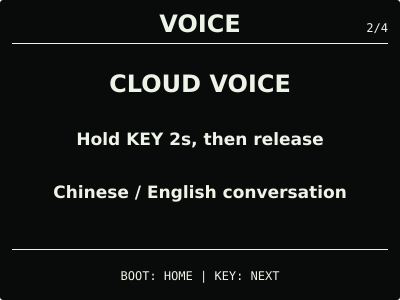
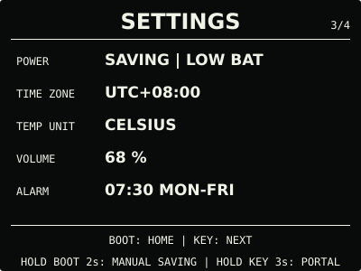
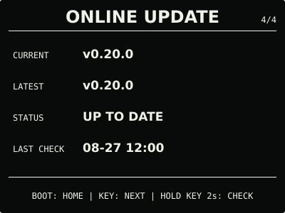

# ESP32 RLCD Firmware v0.20.0

本版加入可选的阿里云百炼 Realtime 云端语音 Beta。设备在线且处于 `NORMAL` 时，用户可
使用自己的 API Key 完成单轮中英文语音问答；未开启、未配置、离线或处于 `SAVING` 时，
仍直接使用本地 MultiNet 指令识别。云端回复只显示和播放，不执行设备操作。

## 效果预览

| 首屏 | 月历 |
| :---: | :---: |
|  |  |
| microSD 图片 | 删除确认 |
|  |  |
| 云端语音 | 设置 |
|  |  |
| 状态 | 在线更新 |
|  |  |

效果图按 400 × 300 实机布局和代表性数据绘制，采用黑色背景、白色像素；全反射屏的实际
观感会随环境光变化。

## 选择文件

| 文件 | 用途 | 大小 | SHA-256 |
| --- | --- | ---: | --- |
| `esp32-rlcd-firmware-v0.20.0-factory.bin` | 首次安装、v0.6.0 及更早版本迁移、故障恢复 | 8.56 MB | `bc97614f3b4235d426b122d6bd4c2d683db4f7b098d5a68660eb4291da17cb2f` |
| `esp32-rlcd-firmware-v0.20.0-ota.bin` | 已安装 v0.7.0+ 后的日常应用更新 | 2.00 MB | `b2a51f112056a896452f814f5f543e35cd67b2974285515c36c78058e41c5e35` |
| `esp32-rlcd-firmware-v0.20.0-model.bin` | 为旧设备通过 USB 补装同版本离线语音模型 | 2.20 MB | `29e156e606a46114b19a3e2f56406bc7045894743ae1e623d0b9e4c5ed1486bf` |

Factory 从 `0x0` 写入，包含 Bootloader、分区表、应用和语音模型，并会清除 NVS。OTA
只包含应用，可用于在线更新或设置门户本地 OTA，并保留 Wi-Fi 与设备偏好。模型不能独立
启动，也不能上传到设置门户。

从 v0.16.0 等旧正式版仅通过在线更新升级时，除离线语音外的功能可以正常使用；首次使用
离线语音还需通过 `update-app.sh` 一次写入同版本 OTA 与模型，或者完整安装 Factory。
已经安装 v0.18.0 兼容模型的设备可以直接使用本版 OTA。

## 本版本变化

- 设置门户新增默认关闭的云端语音开关和 API Key 配置；默认模型为
  `qwen3-omni-flash-realtime`，默认北京共享接口不需要 Workspace ID、App ID 或百炼
  应用；
- 云端模式支持一次最长 10 秒的中文或英文提问，流式显示识别与回复文字并播放语音；每次
  长按都是独立单轮，不保留多轮上下文；
- 高级设置可选择 `qwen-audio-3.0-realtime-flash`，并只允许受控的北京或新加坡百炼官方
  API Host；完整 URL、端口、IP 和任意域名会被拒绝；
- API Key 输入框支持手机直接粘贴，保存后清空且不会由状态接口回显；关闭云端时保留 Key，
  清除使用独立确认；
- 云端只在 `NORMAL`、家庭 Wi-Fi 当前在线且配置完整时使用；其他状态无等待地回退本地
  MultiNet，不影响离线时钟、日历、传感器、图片和闹钟。

用户已确认 `0.20.0-dev.3` 的首屏和原有功能正常，手机可以粘贴并保存 API Key，默认模型
的单轮对话、屏幕文字和扬声器回复正常。正式 OTA 与该候选长度相同，仅 73 bytes 的版本和
构建摘要元数据不同。可选模型、错误 Key、非北京 Host、长输入、断网、抢占与长期连续
会话没有在本轮完成专项目标板矩阵，因此云端语音仍标记为 Beta。

## 安装使用

首次安装、故障恢复或 v0.6.0 及更早版本迁移使用 Factory；已安装 v0.7.0 或更新版本后
可使用 OTA。校验发布文件：

```bash
cd dist/v0.20.0
sha256sum --check SHA256SUMS
```

完整步骤见[发布固件安装指南](../../docs/user-install.md)、
[固件安装与更新](../../docs/firmware-update.md)和
[云端语音 Beta 与 API Key 教程](../../docs/cloud-voice.md)。本版本使用 ESP-IDF v5.5.3
（`2c211b236707889e8400c4dc5644dd5c4ee071e0`）构建，日期为 2026-08-30；实机记录见
[实机验证记录](../../docs/bringup-log.md)。许可证与第三方声明见
[`LICENSE`](../../LICENSE)、[`NOTICE.md`](../../NOTICE.md) 和 [`LICENSES/`](../../LICENSES/)。
