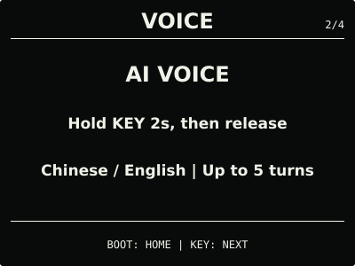
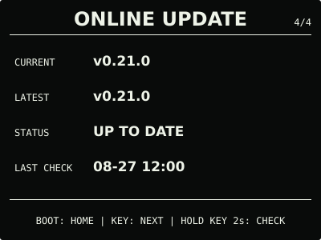

# ESP32 RLCD Firmware v0.21.0

本版将可选的阿里云百炼 AI 语音扩展为有界多轮对话。设备在线且处于 `NORMAL` 时，
用户可在同一 WebSocket 会话中完成最多 5 轮中英文问答；每轮仍需按键明确开始，续问
等待最长 30 秒，新一轮可在会话开始后的 5 分钟内发起；已经开始的收音和回答不会被
总时限截断。未开启、未配置、离线或处于 `SAVING` 时，仍直接
使用本地 MultiNet 指令识别。云端回复只显示和播放，不执行设备操作。

## 效果预览

| 首屏 | 月历 |
| :---: | :---: |
|  |  |
| microSD 图片 | 删除确认 |
|  |  |
| AI 语音 | 设置 |
|  |  |
| 状态 | 在线更新 |
|  |  |

效果图按 400 × 300 实机布局和代表性数据绘制，采用黑色背景、白色像素；全反射屏的实际
观感会随环境光变化。

## 选择文件

| 文件 | 用途 | 大小 | SHA-256 |
| --- | --- | ---: | --- |
| `esp32-rlcd-firmware-v0.21.0-factory.bin` | 首次安装、v0.6.0 及更早版本迁移、故障恢复 | 8.56 MB | `e47a6956addcd8d27e5f52e7bf99a8b9f24d3661d4fb07041c6b1435be324461` |
| `esp32-rlcd-firmware-v0.21.0-ota.bin` | 已安装 v0.7.0+ 后的日常应用更新 | 2.01 MB | `82db5380186ff9bf5c327b20af23623f827d4cf134e18dfc07844d3b53c9bfbb` |
| `esp32-rlcd-firmware-v0.21.0-model.bin` | 为旧设备通过 USB 补装同版本离线语音模型 | 2.20 MB | `29e156e606a46114b19a3e2f56406bc7045894743ae1e623d0b9e4c5ed1486bf` |

Factory 从 `0x0` 写入，包含 Bootloader、分区表、应用和语音模型，并会清除 NVS。OTA
只包含应用，可用于在线更新或设置门户本地 OTA，并保留 Wi-Fi 与设备偏好。模型不能独立
启动，也不能上传到设置门户。

从 v0.16.0 等旧正式版仅通过在线更新升级时，除离线语音外的功能可以正常使用；首次使用
离线语音还需通过 `update-app.sh` 一次写入同版本 OTA 与模型，或者完整安装 Factory。
已经安装 v0.18.0 或更新版本兼容模型的设备可以直接使用本版 OTA。

## 本版本变化

- AI 语音在一次连接中保留上下文，最多 5 轮；屏幕显示当前轮次和续问状态；
- 首轮仍通过长按 `KEY` 2 秒并松开开始；显示 `FOLLOW-UP` 后短按 `KEY` 开始下一轮，
  短按 `BOOT` 结束；
- 回复播放期间短按 `KEY` 可跳过当前回复并直接准备下一轮；连接、监听、思考或播放期间
  短按 `BOOT` 可取消会话；
- 续问等待限制为 30 秒，新一轮准入限制为 5 分钟；达到第 5 轮后自动结束，已经开始的
  回答不会被总时限截断；
- 会话继续复用同一 WebSocket 上下文，保持半双工，不使用唤醒词或后台监听；
- 回复文字持续显示最新 4 行并覆盖最旧行，不再追加省略号；缓冲满时保留最新的完整
  UTF-8 文本；
- 新增多轮状态、按键门控、时间边界、UTF-8 尾缓冲和显示模型的主机自动化测试。

用户已确认 `0.21.0-dev.2` 的首屏和原有功能正常，并实测了同一上下文续问、播放中跳过、
`FOLLOW-UP` 继续以及 `BOOT` 结束等核心路径。用户随后发现旧候选会在第三轮播放中撞上
90 秒硬截止；更新至 `0.21.0-dev.3` 后，目标板对话能够越过原截止点并完整播放回答，
最新 4 行文字也会持续覆盖旧行且不再显示省略号。第 5 轮自动结束、30 秒续问、5 分钟
准入边界及会话后资源回收未在本轮逐项完成专项目标板验收，因此 AI 语音仍标记为 Beta。

正式 OTA 与已验收 `0.21.0-dev.3` 长度相同，仅 73 bytes 的版本、构建时间和镜像摘要
元数据不同；Factory 中的离线语音模型与独立 `-model.bin` 逐字节一致。

错误 API Key、非默认模型、断网、闹钟抢占以及长期连续会话也未在本轮完成专项目标板矩阵。

## 安装使用

首次安装、故障恢复或 v0.6.0 及更早版本迁移使用 Factory；已安装 v0.7.0 或更新版本后
可使用 OTA。校验发布文件：

```bash
cd dist/v0.21.0
sha256sum --check SHA256SUMS
```

完整步骤见[发布固件安装指南](../../docs/user-install.md)、
[固件安装与更新](../../docs/firmware-update.md)和
[AI 语音 Beta 与 API Key 教程](../../docs/cloud-voice.md)。本版本使用 ESP-IDF v5.5.3
（`2c211b236707889e8400c4dc5644dd5c4ee071e0`）构建，日期为 2026-08-31；实机记录见
[实机验证记录](../../docs/bringup-log.md)。许可证与第三方声明见
[`LICENSE`](../../LICENSE)、[`NOTICE.md`](../../NOTICE.md) 和 [`LICENSES/`](../../LICENSES/)。
