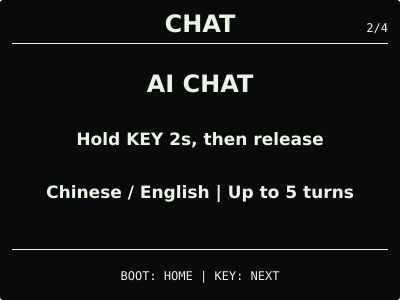
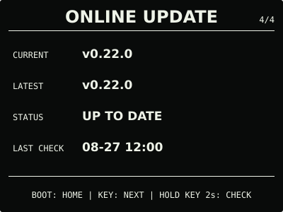

# ESP32 RLCD Firmware v0.22.0

本版继续改善 AI 对话体验。系统中心的页面名称由 `VOICE` 改为 `CHAT`，云端模式显示
`AI CHAT`，离线时显示 `OFFLINE COMMANDS`。页面入口、按键操作和原有配置保持不变。

AI 默认用一至三个短句回答。播放等待不再受固定的总倒计时限制，只在服务端迟迟没有返回
音频或音频中途长时间没有进展时超时。回复文字会跟随设备实际播放的声音逐步显示，不会在
扬声器刚开始播放时直接跳到回答末尾。

## 效果预览

| 首屏 | 月历 |
| :---: | :---: |
|  |  |
| microSD 图片 | 删除确认 |
|  |  |
| 对话 | 设置 |
|  |  |
| 状态 | 在线更新 |
|  |  |

效果图按照 400 × 300 的实机布局绘制，采用黑底白字；全反射屏的实际观感会随环境光变化。

## 选择文件

| 文件 | 用途 | 大小 | SHA-256 |
| --- | --- | ---: | --- |
| `esp32-rlcd-firmware-v0.22.0-factory.bin` | 首次安装、v0.6.0 及更早版本迁移、故障恢复 | 8,560,811 bytes | `1c438d0582f0876921ceeee17d1a2191e45e8b92788041e856bcb7974bcb2753` |
| `esp32-rlcd-firmware-v0.22.0-ota.bin` | 已安装 v0.7.0+ 后的日常应用更新 | 2,008,352 bytes | `1911c1e3170fb2475bf225a08234cf1f603a62012d95c8f6a1d1f316eb220c73` |
| `esp32-rlcd-firmware-v0.22.0-model.bin` | 为旧设备通过 USB 补装离线语音模型 | 2,203,819 bytes | `29e156e606a46114b19a3e2f56406bc7045894743ae1e623d0b9e4c5ed1486bf` |

Factory 从 `0x0` 写入，包含 Bootloader、分区表、应用和离线语音模型，并会清除 NVS。
OTA 只包含应用，可用于在线更新或设置门户本地 OTA，并保留 Wi-Fi 与设备偏好。模型不能
独立启动，也不能上传到设置门户。

已经安装 v0.18.0 或更新版本兼容模型的设备，可以直接使用本版 OTA。从更早版本迁移且
希望使用离线指令时，需要通过项目的 `update-app.sh` 同时写入 OTA 和模型，或者完整安装
Factory。

## 本版本变化

- 系统中心页面改为 `CHAT`，并用 `AI CHAT` 和 `OFFLINE COMMANDS` 区分云端对话与
  本地指令；
- AI 默认给出适合朗读的简短回答，内容较多时先说结论和最重要的几点；
- 移除回答播放的固定总倒计时。只要音频仍在接收或播放，当前回答就不会被计时器截断；
- 回复字幕根据本地播放进度逐步出现，长内容继续滚动显示最新四行；
- 达到模型输出上限时，设备会播完已经收到的内容，不再把这类正常截断显示为对话失败。

`0.22.0-dev.1` 已在目标板完成候选试用并获准发布。本次重点确认对话页面、回答长度、播放
等待和字幕观感，没有把静音、第 5 轮边界、错误 API Key、断网、闹钟抢占或长时间连续使用
写成已经逐项完成的专项验收；AI 对话仍标记为 Beta。

正式 OTA 与已验收候选大小相同。逐字节比较只有 74 bytes 不同，均属于版本、构建时间、
ELF 摘要和镜像摘要元数据；功能代码与离线语音模型没有变化。

## 安装使用

首次安装、故障恢复或从 v0.6.0 及更早版本迁移时使用 Factory；已安装 v0.7.0 或更新版本
后可使用 OTA。校验发布文件：

```bash
cd dist/v0.22.0
sha256sum --check SHA256SUMS
```

完整步骤见[发布固件安装指南](../../docs/user-install.md)、
[固件安装与更新](../../docs/firmware-update.md)和
[AI 对话 Beta 与 API Key 教程](../../docs/cloud-voice.md)。本版本使用 ESP-IDF v5.5.3
构建，日期为 2026-09-01；实机结果见[实机验证记录](../../docs/bringup-log.md)。许可证与
第三方声明见 [`LICENSE`](../../LICENSE)、[`NOTICE.md`](../../NOTICE.md) 和
[`LICENSES/`](../../LICENSES/)。
