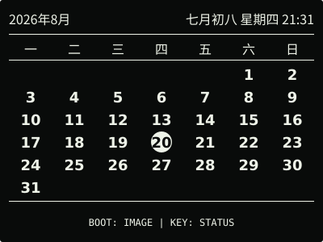
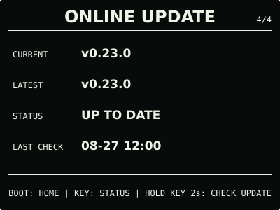

# ESP32 RLCD Firmware v0.23.0

本版集中整理屏幕上的按键提示和长按反馈。页面底部现在直接写明下一页或动作；有效长按在
1 秒后显示动作、剩余时间和松开取消提示，达到原有 2 秒或 3 秒门槛前松开不会误切页面。

## 效果预览

| 首屏 | 月历 |
| :---: | :---: |
|  |  |
| microSD 图片 | 长按提示 |
|  |  |
| AI 对话 | 离线指令 |
|  |  |
| 设置 | 在线更新 |
|  |  |

效果图按照 400 × 300 的实机布局绘制，采用黑底白字；全反射屏的实际观感会随环境光变化。

## 选择文件

| 文件 | 用途 | 大小 | SHA-256 |
| --- | --- | ---: | --- |
| `esp32-rlcd-firmware-v0.23.0-factory.bin` | 首次安装、v0.6.0 及更早版本迁移、故障恢复 | 8,560,811 bytes | `c29551af417b497520b8136638d6daf51af8c6a3be1bd43f3220ff28f495397b` |
| `esp32-rlcd-firmware-v0.23.0-ota.bin` | 已安装 v0.7.0+ 后的日常应用更新 | 2,009,056 bytes | `12fa7f8c214106581584870698522aa32b5c4d68b6e67c17d7e6b648c4a61f71` |
| `esp32-rlcd-firmware-v0.23.0-model.bin` | 为旧设备通过 USB 补装离线语音模型 | 2,203,819 bytes | `29e156e606a46114b19a3e2f56406bc7045894743ae1e623d0b9e4c5ed1486bf` |

Factory 从 `0x0` 写入，包含 Bootloader、分区表、应用和离线语音模型，并会清除 NVS。
OTA 只包含应用，可用于在线更新或设置门户本地 OTA，并保留 Wi-Fi 与设备偏好。模型不能
独立启动，也不能上传到设置门户。

已经安装 v0.18.0 或更新版本兼容模型的设备，可以直接使用本版 OTA。从更早版本迁移且
希望使用离线指令时，需要通过项目的 `update-app.sh` 同时写入 OTA 和模型，或者完整安装
Factory。

## 本版本变化

- 月历、图片和四个系统页的页脚直接说明下一目的地或动作；
- 状态页明确显示手动校时，设置页显示网页设置及手动省电的下一状态，在线更新按当前状态
  显示检查、查看或安装；
- 图片删除、手动校时、开始对话、网页设置、手动省电和在线更新统一显示长按进度，提前
  松开即可取消；
- `AI CHAT` 和 `OFFLINE COMMANDS` 分别提示提问或说出一条设备指令；
- 对话结束、失败或取消后的短暂结果页明确显示正在返回对话页。

`0.23.0-dev.1` 已在目标板完成整体试用并获准发布。本轮没有形成逐项专项实机矩阵，不把
长按动作、模态门控和边界条件的主机测试扩大表述为全部目标板验收。

正式 OTA 与候选大小相同。逐字节比较共有 75 bytes 不同：版本字段 6 bytes、构建时间
4 bytes、ELF 摘要 32 bytes，以及镜像校验字节和镜像摘要 33 bytes；功能代码和离线
语音模型没有变化。

## 安装使用

首次安装、故障恢复或从 v0.6.0 及更早版本迁移时使用 Factory；已安装 v0.7.0 或更新版本
后可使用 OTA。校验发布文件：

```bash
cd dist/v0.23.0
sha256sum --check SHA256SUMS
```

完整步骤见[发布固件安装指南](../../docs/user-install.md)、
[固件安装与更新](../../docs/firmware-update.md)和
[AI 对话 Beta 与 API Key 教程](../../docs/cloud-voice.md)。本版本使用 ESP-IDF v5.5.3
构建，日期为 2026-09-01；实机结果见[实机验证记录](../../docs/bringup-log.md)。许可证与
第三方声明见 [`LICENSE`](../../LICENSE)、[`NOTICE.md`](../../NOTICE.md) 和
[`LICENSES/`](../../LICENSES/)。
