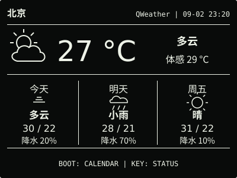
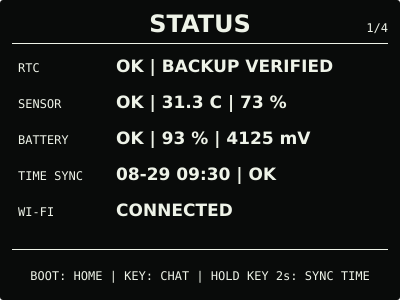
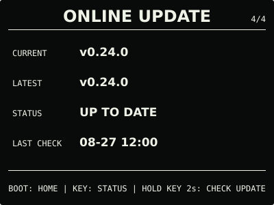

# ESP32 RLCD Firmware v0.24.0

本版新增可选天气 Beta。设备使用用户自己的 QWeather API Host 和 API Key 直连天气服务，
显示所选城市的实时天气、三日预报和更新时间；成功数据会缓存，短时断网不影响 RTC、月历、
传感器及其他离线功能。

## 效果预览

| 首屏 | 天气 |
| :---: | :---: |
|  |  |
| 月历 | microSD 图片 |
|  |  |
| 对话 | 设置 |
|  |  |
| 状态 | 在线更新 |
|  |  |

效果图按照 400 × 300 的实机布局绘制，采用黑底白字；全反射屏的实际观感会随环境光变化。

## 选择文件

| 文件 | 用途 | 大小 | SHA-256 |
| --- | --- | ---: | --- |
| `esp32-rlcd-firmware-v0.24.0-factory.bin` | 首次安装、v0.6.0 及更早版本迁移、故障恢复 | 8,560,811 bytes | `2e95b53e97b06ec993e0c621ad370026fe96ce5774f50aa38ad9dada5be7314a` |
| `esp32-rlcd-firmware-v0.24.0-ota.bin` | 已安装 v0.7.0+ 后的日常应用更新 | 2,072,304 bytes | `dd5bfc8d38f6a05f5f34d776bc474bbe766459ca7fe12f376ab193959569e80b` |
| `esp32-rlcd-firmware-v0.24.0-model.bin` | 为旧设备通过 USB 补装离线语音模型 | 2,203,819 bytes | `29e156e606a46114b19a3e2f56406bc7045894743ae1e623d0b9e4c5ed1486bf` |

Factory 从 `0x0` 写入，包含 Bootloader、分区表、应用和离线语音模型，并会清除 NVS。
OTA 只包含应用，可用于在线更新或设置门户本地 OTA，并保留 Wi-Fi 与设备偏好。模型不能
独立启动，也不能上传到设置门户。

已经安装 v0.18.0 或更新版本兼容模型的设备，可以直接使用本版 OTA。从更早版本迁移且
希望使用离线指令时，需要通过项目的 `update-app.sh` 同时写入 OTA 和模型，或者完整安装
Factory。

## 本版本变化

- 设置门户按“省份 → 城市”选择地点，保存 QWeather API Host 和 API Key 后无需重启；
- 新增独立天气页，显示当前天气、体感温度、三日预报、更新时间和缓存状态；
- 实时天气约每 30 分钟刷新，三日预报约每 6 小时刷新；断网或后台刷新失败时保留缓存；
- 天气获取、无数据和失败状态都使用稳定页面，不再显示临时全屏结果或自动跳回首屏；
- 修复 QWeather Gzip 解压占满天气任务栈导致的设备重启，以及分块响应被误判为空正文的
  问题。

用户通过在线更新安装候选固件，确认真实地点天气能够正常获取和显示，重启问题已解除。
天气功能仍为 Beta，其他异常场景继续按文档中的降级边界处理。

## 安装使用

首次安装、故障恢复或从 v0.6.0 及更早版本迁移时使用 Factory；已安装 v0.7.0 或更新版本
后可使用 OTA。校验发布文件：

```bash
cd dist/v0.24.0
sha256sum --check SHA256SUMS
```

完整步骤见[发布固件安装指南](../../docs/user-install.md)、
[固件安装与更新](../../docs/firmware-update.md)、[天气 Beta](../../docs/weather.md)和
[AI 对话 Beta 与 API Key 教程](../../docs/cloud-voice.md)。本版本使用 ESP-IDF v5.5.3
构建，日期为 2026-09-02；实机结果见[实机验证记录](../../docs/bringup-log.md)。许可证与
第三方声明见 [`LICENSE`](../../LICENSE)、[`NOTICE.md`](../../NOTICE.md) 和
[`LICENSES/`](../../LICENSES/)。
