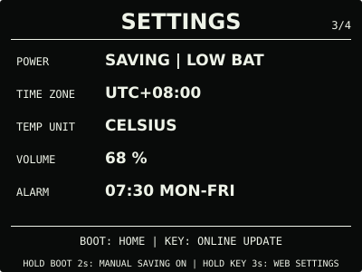
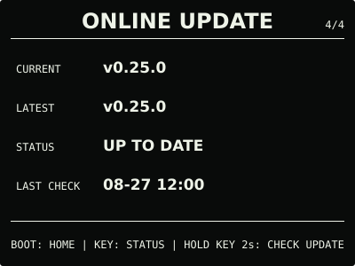
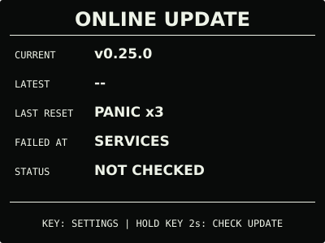

# ESP32 RLCD Firmware v0.25.0

天气页增加当前日期、星期与按键刷新，天气数据更新时间单独显示。本版还增加启动恢复
入口，并完善新固件的启动确认。

## 效果预览

| 首屏 | 天气 |
| :---: | :---: |
|  |  |
| 月历 | microSD 图片 |
|  |  |
| 对话 | 设置 |
|  |  |
| 状态 | 在线更新 |
|  |  |
| 恢复：在线更新 | 恢复：设置 |
|  |  |

效果图按照 400 × 300 的实机布局绘制，采用黑底白字；实际观感会随环境光变化。

## 选择文件

| 文件 | 用途 | 大小 | SHA-256 |
| --- | --- | ---: | --- |
| `esp32-rlcd-firmware-v0.25.0-factory.bin` | 首次安装、旧版迁移和完整恢复 | 8.56 MB | `3a38daf322f848b4f8b328c641131f15ff628709aa36a2332953dfb1bf3075d3` |
| `esp32-rlcd-firmware-v0.25.0-ota.bin` | 已安装 v0.7.0+ 后的日常应用更新 | 2.09 MB | `2fc9eff71036077b905473db308744af043ef6c214b5077cb8180416a7943e52` |
| `esp32-rlcd-firmware-v0.25.0-model.bin` | 为旧设备通过 USB 补装离线语音模型 | 2.20 MB | `29e156e606a46114b19a3e2f56406bc7045894743ae1e623d0b9e4c5ed1486bf` |

MB 按 1,000,000 bytes 换算。Factory 从 `0x0` 写入，包含 Bootloader、分区表、应用与
语音模型，并会清除 NVS。OTA 只更新应用，保留 Wi-Fi 与设备偏好；模型不能独立启动，
也不能上传到设置门户。

已经安装兼容语音模型的设备，可直接在线更新或上传本版 OTA。从 v0.16.0 或更早版本迁移
且希望使用语音时，需通过 `update-app.sh` 同时写入 OTA 与模型，或完整安装 Factory。

## 本版本变化

- 天气顶栏显示 RTC 当前日期和星期，底部显示数据获取的月日与时间；断网时仍能区分今天
  与旧缓存，RTC 无效时保留稳定占位符；
- 天气页按住 `KEY` 2 秒即可刷新，`SAVING` 也允许为本次操作临时联网；刷新失败时保留
  同地点的最近缓存，天气内容与三日预报大小不变；
- 开机按住 `KEY` 可进入恢复模式，连续 3 次异常启动后的下一次启动也会进入。恢复页只
  提供在线更新与精简设置门户，支持 Wi-Fi 管理和本地 OTA；
- OTA 启动确认至少等待 15 秒，并检查显示、按键和首轮任务；连续正常运行 60 秒后才
  清除启动异常计数。正常断电和已标记的升级重启不会沿用旧故障记录。

用户确认本轮候选天气界面显示正常，并同意发布。异常复位注入、恢复模式 OTA 与回滚等
专项场景尚未逐项形成实机记录，继续保留在开发计划中；天气与 AI 对话仍为 Beta。

## 安装使用

校验发布文件：

```bash
cd dist/v0.25.0
sha256sum --check SHA256SUMS
```

日常升级进入 `ONLINE UPDATE`，按住 `KEY` 2 秒检查；找到更新后再次按住 2 秒查看，
确认页按住 3 秒安装。已有兼容模型时，无需数据线或重新配网。

完整步骤见[发布固件安装指南](../../docs/user-install.md)、
[固件安装与更新](../../docs/firmware-update.md)、[天气 Beta](../../docs/weather.md)和
[AI 对话 Beta 与 API Key 教程](../../docs/cloud-voice.md)。本版使用 ESP-IDF v5.5.3
构建，日期为 2026-09-05；构建与实机记录见[实机验证记录](../../docs/bringup-log.md)。
许可证与第三方声明见 [`LICENSE`](../../LICENSE)、[`NOTICE.md`](../../NOTICE.md) 和
[`LICENSES/`](../../LICENSES/)。
