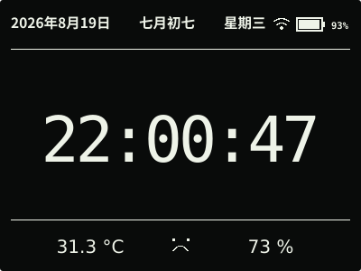
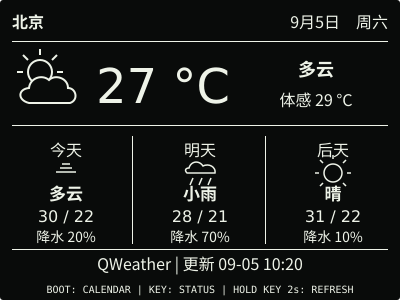
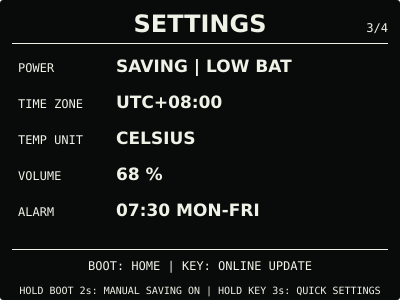
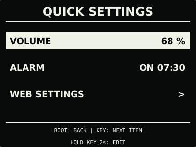
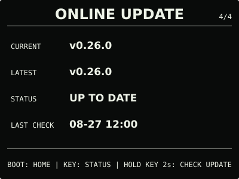

# ESP32 RLCD Firmware v0.26.0

切到哪一页就停在哪一页，由你手动切换或返回。设备增加简短的快捷设置菜单，
调整音量、开关闹钟不必连接热点。

## 效果预览

| 首屏 | 天气 |
| :---: | :---: |
|  |  |
| 月历 | microSD 图片 |
|  |  |
| 对话 | 设置 |
|  |  |
| 快捷设置 | 闹钟 |
|  |  |
| 状态 | 在线更新 |
|  |  |

效果图按照 400 × 300 的实机布局绘制，采用黑底白字；实际观感会随环境光变化。

## 选择文件

| 文件 | 用途 | 大小 | SHA-256 |
| --- | --- | ---: | --- |
| `esp32-rlcd-firmware-v0.26.0-factory.bin` | 首次安装、旧版迁移和完整恢复 | 8.56 MB | `81b95480356c7c5cf8ff667a7981c90497d29200decfbe6498fc4e2d503ee560` |
| `esp32-rlcd-firmware-v0.26.0-ota.bin` | 已安装 v0.7.0+ 后的日常应用更新 | 2.09 MB | `096901074a467700991fc45a5382d20d11d4232284005b83ee957158cd52e7dd` |
| `esp32-rlcd-firmware-v0.26.0-model.bin` | 为旧设备通过 USB 补装离线语音模型 | 2.20 MB | `29e156e606a46114b19a3e2f56406bc7045894743ae1e623d0b9e4c5ed1486bf` |

MB 按 1,000,000 bytes 换算。Factory 从 `0x0` 写入，包含 Bootloader、分区表、应用与
语音模型，并会清除 NVS。OTA 只更新应用，保留 Wi-Fi 与设备偏好；模型不能独立启动，
也不能上传到设置门户。

已经安装兼容语音模型的设备，可直接在线更新或上传本版 OTA。从 v0.16.0 或更早版本迁移
且希望使用语音时，需通过 `update-app.sh` 同时写入 OTA 与模型，或完整安装 Factory。

## 本版本变化

- 日常页、系统页与快捷菜单不再因无操作返回时钟；正常开机仍进入时钟，不记忆上次页面，
  也无需另设常驻页。图片继续显示选中的文件，不自动轮播；
- `SETTINGS` 按住 `KEY` 3 秒进入三项快捷菜单：`VOLUME`、`ALARM`、`WEB SETTINGS`。
  短按 `KEY` 选择，按住 2 秒编辑或打开网页，短按 `BOOT` 返回；
- 编辑时短按 `KEY` 修改、按住 2 秒保存，短按 `BOOT` 取消；编辑超时只丢弃草稿并返回
  菜单。保存后热应用，不重启、不主动联网；闹钟时间与重复日期仍在网页设置；
- 保留手动省电、网页本地 OTA 与恢复门户。旧版设置及 dev.1 的其余偏好均可继续读取，
  不需要恢复出厂设置；对话、热点与确认操作仍有各自必要的时限。

用户确认 v0.26.0-dev.2 使用正常并同意发布；正式版与该候选使用相同功能源码。
天气与 AI 对话仍为 Beta；异常复位注入、恢复模式 OTA、真实断电回滚与长期功耗等
专项验证继续保留在[开发计划](../../docs/roadmap.md)，不扩大整体使用反馈的验收范围。

## 安装使用

校验发布文件：

```bash
cd dist/v0.26.0
sha256sum --check SHA256SUMS
```

日常升级进入 `ONLINE UPDATE`，按住 `KEY` 2 秒检查；找到更新后再次按住 2 秒查看，
确认页按住 3 秒安装。已有兼容模型时，无需数据线或重新配网。

没有互联网时，在快捷菜单选择 `WEB SETTINGS`，按住 `KEY` 2 秒打开本地设置热点，
连接后上传 OTA。v0.25.0 及更早版本仍在 `SETTINGS` 长按 3 秒直接打开热点；
恢复模式也保留原来的直接入口。

完整步骤见[发布固件安装指南](../../docs/user-install.md)、
[固件安装与更新](../../docs/firmware-update.md)和[设备设置](../../docs/device-settings.md)。
本版使用 ESP-IDF v5.5.3 构建，日期为 2026-09-05；构建与验证见
[实机验证记录](../../docs/bringup-log.md)。许可证与第三方声明见
[`LICENSE`](../../LICENSE)、[`NOTICE.md`](../../NOTICE.md) 和 [`LICENSES/`](../../LICENSES/)。
