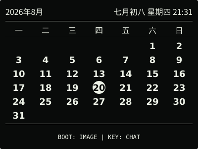
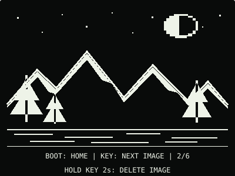
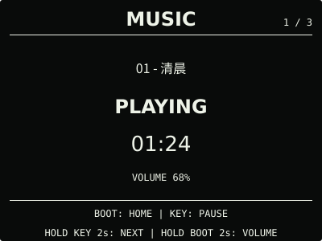
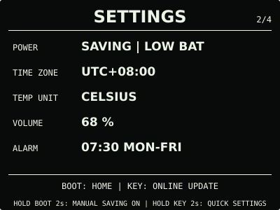
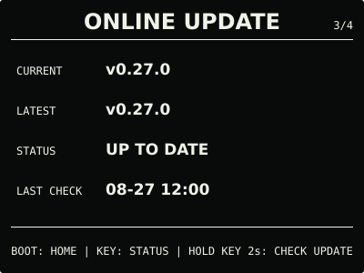

# ESP32 RLCD Firmware v0.27.0

新增 microSD 音乐播放，歌曲可直接在设置门户上传、播放和删除。设备保留简单播放操作，
设置菜单与网页一起做了整理。

## 效果预览

| 首屏 | 天气 |
| :---: | :---: |
|  |  |
| 月历 | microSD 图片 |
|  |  |
| microSD 音乐 | 对话 |
|  |  |
| 设置 | 快捷设置 |
|  |  |
| 闹钟 | 在线更新 |
|  |  |

效果图按照 400 × 300 的实机布局绘制，采用黑底白字；实际观感会随环境光变化。

## 选择文件

| 文件 | 用途 | 大小 | SHA-256 |
| --- | --- | ---: | --- |
| `esp32-rlcd-firmware-v0.27.0-factory.bin` | 首次安装、旧版迁移和完整恢复 | 8.56 MB | `7eb96fe4258df5b1ae53b6a1f5d3339b4622d34a3c0a9d64e67cf90068fdaef9` |
| `esp32-rlcd-firmware-v0.27.0-ota.bin` | 已安装 v0.7.0+ 后的日常应用更新 | 2.17 MB | `48757604032ddb2f8d2fa614d938fe85c76be2a382e8007e31d010ff0b7882fd` |
| `esp32-rlcd-firmware-v0.27.0-model.bin` | 为旧设备通过 USB 补装离线语音模型 | 2.20 MB | `29e156e606a46114b19a3e2f56406bc7045894743ae1e623d0b9e4c5ed1486bf` |

MB 按 1,000,000 bytes 换算。Factory 从 `0x0` 写入，包含 Bootloader、分区表、应用与
语音模型，并会清除 NVS。OTA 只更新应用，保留 Wi-Fi、API Key 与设备偏好；模型不能独立启动，
也不能上传到设置门户。已经安装兼容模型的设备不必重写模型或重新配网。

## 本版本变化

- 播放 FAT32 microSD `rlcd/music/` 中的 MP3 或 16 位 PCM WAV，支持暂停、下一首与音量调整。
  返回时钟后可继续播放，列表播放完毕停止；无卡或无歌曲时隐藏音乐页，不自动播放或联网。
- 设置门户提供歌单、手机/电脑上传、在设备播放、停止与确认删除。单次上传最大 32 MB，
  最多 32 首；直接存入 SD 卡，不经项目服务器。同名不覆盖，写入和删除后即时生效、不重启。
- 系统中心顺序为对话、设置、在线更新、状态。正常设置入口统一按住 KEY 2 秒，
  快捷闹钟长按即可切换开关；闹钟时间等复杂设置仍在门户中完成。
- 网页常用设置直接可见，天气、AI、音乐与本地升级按需展开；各区保存和歌单刷新
  不覆盖其他区域未保存的输入，页脚提供动态年份与项目链接。
- 音乐与语音共用唯一音频工作任务，写卡前安全停止播放；闹钟、对话和维护中断后不自动续播。
  分区、语音模型与现有配置布局不变。

用户确认 v0.27.0-dev.2 使用正常并同意发布。正式 OTA 与该候选等长，仅版本、构建时间、
ELF 摘要和镜像校验字段不同，没有新增功能代码。天气与 AI 对话仍为 Beta；长期播放、慢卡、
写入时断电、闹钟抢占与恢复异常等专项验证继续记录在[开发计划](../../docs/roadmap.md)。

## 安装使用

日常升级进入 `ONLINE UPDATE`，按住 `KEY` 2 秒检查；找到更新后再次按住 2 秒查看，
确认页按住 3 秒安装。没有互联网时，在设备快捷菜单中打开 `WEB SETTINGS`，连接热点后上传 OTA。
v0.26.0 的快捷菜单入口为长按 3 秒；v0.27.0 起为 2 秒，恢复模式仍为 3 秒。

校验下载文件：

```bash
cd dist/v0.27.0
sha256sum --check SHA256SUMS
```

歌曲准备与操作见 [microSD 音乐播放](../../docs/music-player.md)。首次安装和旧版迁移见
[发布固件安装指南](../../docs/user-install.md)，更新与恢复见
[固件安装与更新](../../docs/firmware-update.md)。本版使用 ESP-IDF v5.5.3 构建，日期为
2026-09-05；验证事实见[实机验证记录](../../docs/bringup-log.md)。许可证和第三方材料见
[`LICENSE`](../../LICENSE)、[`NOTICE.md`](../../NOTICE.md) 与 [`LICENSES/`](../../LICENSES/)。
