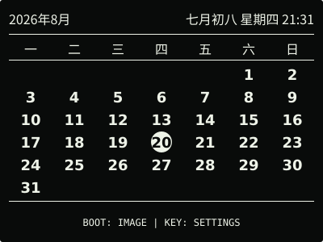
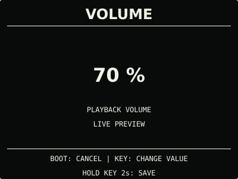
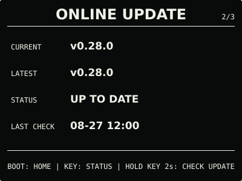

# ESP32 RLCD Firmware v0.28.0

网页设置更容易打开，音乐上传与音量调节更顺手，在线更新不再沿用过期目标。

## 效果预览

| 首屏 | 天气 |
| :---: | :---: |
|  |  |
| 月历 | microSD 图片 |
|  |  |
| microSD 音乐 | 对话 |
|  |  |
| 设置 | 音量 |
|  |  |
| 闹钟 | 在线更新 |
|  |  |

400 × 300 黑底白字；设置页使用真实点阵字体像素，其余为布局示意。全反射屏观感随环境光变化。

## 主要变化

- SETTINGS 长按 KEY 2 秒直接打开网页。同一家庭 Wi-Fi 下可扫码授权访问；无网或主动
  切换时保留设备热点。网页按常用、联网、媒体、维护分区，独立保存且保留未提交输入。
- Chat 移入 BOOT 日常页面环，系统只留设置、在线更新、状态；电源信息居中，操作提示
  更清楚。设备只保留省电开关与音乐音量，闹钟等配置交给网页。
- 歌曲支持多选、依次上传，每首最大 32 MB。浏览设置和歌单不中断音乐，写卡才安全停止。
  音乐页显示两行歌名；音量可即时试听，取消或超时恢复已保存值。
- 闹钟使用独立音量并提供试听，旧配置升级时沿用媒体音量。门户按用户活动计算 5 分钟
  闲置期限，一次最多 30 分钟，写入另有最多 10 分钟时限。
- 在线更新在确认前刷新清单，目标变化时展示新版本并重新确认；清单被拒绝不会误报成功
  或重启。安装仍需实体按键确认，不自动下载或安装。

局域网 HTTP 仅限可信家庭网络，可管理普通设置、RTC 和媒体。编辑 Wi-Fi、天气、AI 凭据
以及本地 OTA 必须切换设备热点。不要公开访问码或二维码，不做路由器端口映射。

## 选择文件

| 文件 | 用途 | 大小 |
| --- | --- | ---: |
| `esp32-rlcd-firmware-v0.28.0-factory.bin` | 首次安装与完整恢复，从 0x0 写入并清除配置 | 8.56 MB |
| `esp32-rlcd-firmware-v0.28.0-ota.bin` | 日常应用更新，保留 Wi-Fi、API Key 和设备偏好 | 2.19 MB |
| `esp32-rlcd-firmware-v0.28.0-model.bin` | 旧设备通过 USB 补装离线语音模型 | 2.20 MB |

MB 按 1,000,000 字节换算，摘要见 [SHA256SUMS](SHA256SUMS)。Factory 包含 Bootloader、
分区、应用和语音模型；OTA 只更新应用，不能为旧设备补装模型。已经安装兼容模型的设备
不必重新配网或重写模型。

## 安装使用

进入 ONLINE UPDATE，长按 KEY 2 秒检查，有更新便显示确认页；松开后再长按 3 秒安装。
v0.27.0 及更早版本还需按提示长按 2 秒进入确认页。没有互联网时，打开网页设置并切换
设备热点，在“维护 → 本地固件更新”上传 OTA。旧版门户入口见[设备设置](../../docs/device-settings.md)。

```sh
cd dist/v0.28.0
sha256sum --check SHA256SUMS
```

首次安装与旧版迁移见[发布固件安装指南](../../docs/user-install.md)，更新与恢复见
[固件安装与更新](../../docs/firmware-update.md)。

## 验证与兼容

2026-09-14 用户确认候选后同意发布。正式版沿用 dev.3 功能源码，OTA 等长，仅 74 字节的
版本、构建信息和镜像校验字段不同。固定 ESP-IDF v5.5.3 构建、主机测试、真实字体像素
布局测试、仓库与许可检查通过。分区和模型不变，偏好从 v0.27.0 的 schema v7 迁移到 v8，
保留旧槽并继承闹钟音量；Wi-Fi、天气和 AI 凭据布局不变。

天气与 AI 对话仍为 Beta；长期播放、慢卡、写入时断电、闹钟抢占、异常启动和网络边界等
专项验证继续记录在[开发计划](../../docs/roadmap.md)，不把整体反馈当作全部专项通过。
实施与候选记录见[v0.28.0 记录](../../docs/v0.28-plan.md)。

许可证与第三方材料见 [LICENSE](../../LICENSE)、[NOTICE.md](../../NOTICE.md) 和
[LICENSES](../../LICENSES/)。
