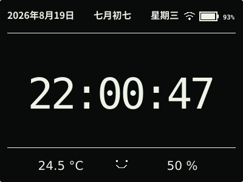
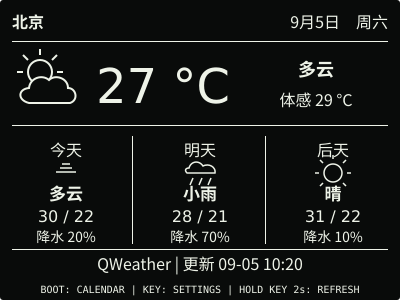
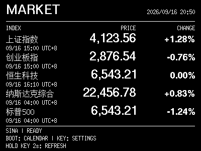
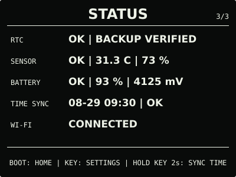
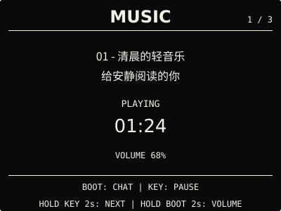
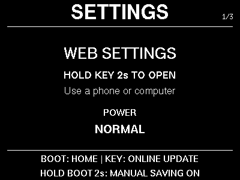
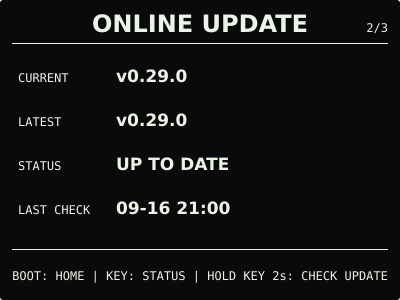

# ESP32 RLCD Firmware v0.29.0

新增可选市场看板，从 15 个指数中选择 1–5 项，查看点位、涨跌幅和各自的报价时间。

## 效果预览

| 首屏 | 天气 |
| :---: | :---: |
|  |  |
| 市场看板 | 状态 |
|  |  |
| 月历 | microSD 图片 |
|  |  |
| microSD 音乐 | 对话 |
|  |  |
| 设置 | 音量 |
|  |  |
| 闹钟 | 在线更新 |
|  |  |

400 × 300 黑底白字，市场与设置页使用固件同款点阵字体；示例报价不是实时行情。
全反射屏的实际观感随环境光变化。

## 主要变化

- 新增独立 `MARKET` 页面，位于天气与月历之间，不改变时钟首屏和系统菜单。
- 网页“联网 → 市场看板”可开关功能、选择指数并调整顺序；同 Wi-Fi 授权入口和设备热点
  均可管理，保存后生效、不重启、不清空其他表单草稿。
- 设备通过 HTTPS 直连新浪，无需 API Key 或 SD 卡。正常模式停留本页时约每 2 分钟获取，
  离开后停止周期请求；省电时不自动联网，可按住 KEY 2 秒手动刷新。
- 每项保留原报价日期与时间，失败时保留最近有效值；首次无数据用 `--`，不因错误跳回时钟。

看板默认关闭，开启方法和 15 个预设见[市场看板](../../docs/market-dashboard.md)。
报价可能延迟，各市场交易日期也可能不同；本功能继续标记为 Beta。

## 选择文件

| 文件 | 用途 | 大小 |
| --- | --- | ---: |
| `esp32-rlcd-firmware-v0.29.0-factory.bin` | 首次安装与完整恢复，从 0x0 写入并清除配置 | 8.56 MB |
| `esp32-rlcd-firmware-v0.29.0-ota.bin` | 日常应用更新，保留 Wi-Fi、API Key 和设备偏好 | 2.21 MB |
| `esp32-rlcd-firmware-v0.29.0-model.bin` | 旧设备通过 USB 补装离线语音模型 | 2.20 MB |

MB 按 1,000,000 字节换算，摘要见 [SHA256SUMS](SHA256SUMS)。Factory 包含 Bootloader、
分区、应用和语音模型；OTA 只更新应用，不能为旧设备补装模型。已安装兼容模型时，无需
重新配网或重写模型；从 dev.1 更新也保留市场看板的开关、选择和顺序。

## 安装使用

在 `ONLINE UPDATE` 按住 KEY 2 秒检查，看到 v0.29.0 后松开，再按住 3 秒安装。
v0.27.0 及更早版本还需按提示长按 2 秒进入确认页。没有互联网时，打开网页设置并切换
设备热点，在“维护 → 本地固件更新”上传 OTA。旧版入口见[设备设置](../../docs/device-settings.md)。

```sh
cd dist/v0.29.0
sha256sum --check SHA256SUMS
```

首次安装与旧版迁移见[发布固件安装指南](../../docs/user-install.md)，更新与恢复见
[固件安装与更新](../../docs/firmware-update.md)。

## 验证与兼容

2026-09-16，用户确认 dev.1 显示效果并同意发布。正式版沿用相同功能源码；分区、
离线语音模型及已有设置布局不变，新增看板配置使用独立 NVS 记录。
正式 OTA 与候选等长，仅 75 字节的版本、构建信息和镜像校验字段不同。
固定 ESP-IDF v5.5.3 构建、主机测试、真实字体布局、仓库与许可检查通过。

市场看板、天气和 AI 对话继续保留 Beta。长期运行、断网、省电、闹钟抢占与网络资源交接等
专项实测继续记录在[开发计划](../../docs/roadmap.md)，不将整体显示反馈当作全部专项通过。
候选构建与数据源验证见[市场看板记录](../../docs/market-dashboard.md#验证记录)。

许可证与第三方材料见 [LICENSE](../../LICENSE)、[NOTICE.md](../../NOTICE.md) 和
[LICENSES](../../LICENSES/)。
