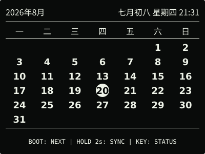
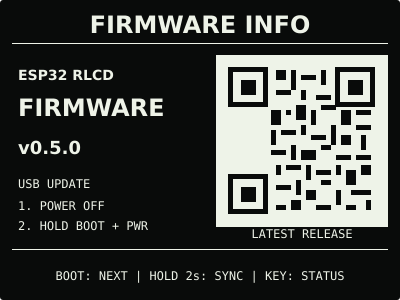
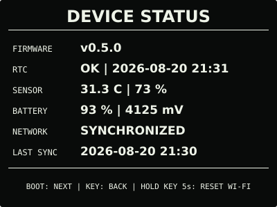

# ESP32 RLCD Firmware v0.5.0

这是由本项目源码及固定开源依赖构建并经过实机验收的 v0.5.0 正式发布物。








> 效果图按 400 × 300 实机布局和代表性数据绘制，采用黑色背景、白色像素。全反射屏的
> 实际观感会随环境光变化。

| 项目 | 值 |
| --- | --- |
| 文件 | `esp32-rlcd-firmware-v0.5.0.bin` |
| 烧录地址 | `0x0` |
| 大小 | 1,341,088 bytes |
| SHA-256 | `6d68aa6ba3eb17fd6c2fc16cd064c1ac173de62790ab8d29f0649cbd5c3a3c00` |
| 应用镜像 SHA-256 | `fcfed8e730d85f41f9138d3161157fa6ef3c09e4b8fcea14dd5b152572c15885` |
| 芯片 | ESP32-S3 |
| Flash | 16 MB |
| ESP-IDF | v5.5.3 (`2c211b236707889e8400c4dc5644dd5c4ee071e0`) |
| 构建日期 | 2026-08-20 |
| 功能与布局实机验收 | 通过 |

本版本为板载 `BOOT` 增加运行时操作：短按可循环查看首屏、当月月历和固件信息页，长按
2 秒可立即联网校时。月历突出今天，固件信息页提供最新 Release 二维码；次级页面超时
返回、`KEY` 原有操作和 ROM 下载模式均保持正常。

完整镜像会覆盖 NVS，因此安装后需重新配网。在仓库根目录执行：

```bash
cd dist/v0.5.0
sha256sum --check SHA256SUMS
cd ../..
./scripts/flash.sh --port COM5 \
  --firmware dist/v0.5.0/esp32-rlcd-firmware-v0.5.0.bin \
  --confirm
```

烧录后正常开机，按屏幕二维码连接临时热点；配网页面没有自动打开时访问
`http://192.168.4.1`。完整步骤见[发布固件安装指南](../../docs/user-install.md)，验证结果见
[实机验证记录](../../docs/bringup-log.md)。项目许可证、第三方组件和字体的完整声明见
[`LICENSE`](../../LICENSE)、[`NOTICE.md`](../../NOTICE.md) 与
[`LICENSES/`](../../LICENSES/)；再分发此固件时必须同时保留这些材料。
