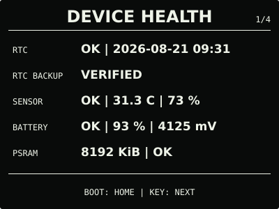
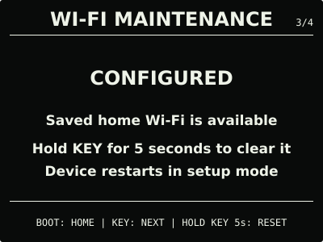
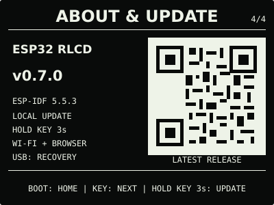
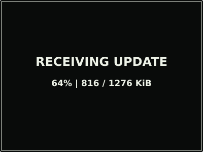

# ESP32 RLCD Firmware v0.7.0

这是由本项目源码及固定开源依赖构建，并在 Waveshare ESP32-S3-RLCD-4.2 实机完成
Factory 迁移、本地 OTA、Wi-Fi 配置保留和 RTC 备用供电验收的正式发布物。

| 首屏 | 月历 |
| :---: | :---: |
|  |  |
| 设备健康 | 网络与时间 |
|  |  |
| Wi-Fi 维护 | 关于与更新 |
|  |  |
| 固件升级 | 升级进度 |
|  |  |

> 效果图按 400 × 300 实机布局和代表性数据绘制，采用黑色背景、白色像素。全反射屏的
> 实际观感会随环境光变化。

## 选择固件

| 文件 | 用途 | 大小 | SHA-256 |
| --- | --- | ---: | --- |
| `esp32-rlcd-firmware-v0.7.0-factory.bin` | 首次安装、v0.6.0 及更早版本迁移、故障恢复 | 1,364,736 bytes | `112e1a0eb05f83af2d6cda46863c89ba0736f967963120c4c26c1eb0d378d67b` |
| `esp32-rlcd-firmware-v0.7.0-ota.bin` | 已安装 v0.7.0+ 后的日常本地升级 | 1,299,200 bytes | `9da007246a680020f706dce96ba5ab990d9d6edfb13d2e4c4c44704a790bc652` |

Factory 镜像从 `0x0` 写入，包含 Bootloader、分区表和应用，并会清除 NVS；OTA 镜像只
包含应用，通过设备本地升级网页写入，不会清除已保存的家庭 Wi-Fi。两种文件不能互换。

## 安装使用

从 v0.6.0 或更早版本升级时，必须先用 Factory 镜像完成一次双 OTA 分区迁移：

```bash
cd dist/v0.7.0
sha256sum --check SHA256SUMS
cd ../..
./scripts/flash.sh --port COM5 \
  --firmware dist/v0.7.0/esp32-rlcd-firmware-v0.7.0-factory.bin \
  --confirm
```

迁移后需要重新配网一次。以后升级时下载 `-ota.bin`，短按 `KEY` 进入系统中心并切换到
“关于与更新”，按住 `KEY` 3 秒；扫描屏幕二维码连接临时热点，在没有自动打开网页时
访问 `http://192.168.4.1`，上传 OTA 文件并等待设备校验、重启。

完整步骤和故障恢复见[发布固件安装指南](../../docs/user-install.md)与
[固件安装和本地升级](../../docs/firmware-update.md)。本版本使用 ESP-IDF v5.5.3
（`2c211b236707889e8400c4dc5644dd5c4ee071e0`）构建，日期为 2026-08-21；实机验证记录见
[实机验证记录](../../docs/bringup-log.md)。许可证与第三方声明见
[`LICENSE`](../../LICENSE)、[`NOTICE.md`](../../NOTICE.md) 和 [`LICENSES/`](../../LICENSES/)。
