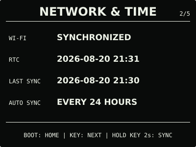
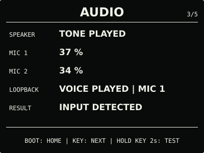
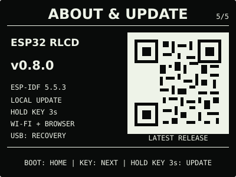
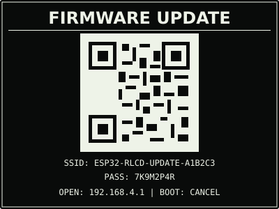

# ESP32 RLCD Firmware v0.8.0

这是由本项目源码及固定开源依赖构建，并在 Waveshare ESP32-S3-RLCD-4.2 实机完成
本地 OTA、ES8311 扬声器、ES7210 双麦克风和临时语音回放验收的正式发布物。

| 首屏 | 月历 |
| :---: | :---: |
|  |  |
| 设备健康 | 网络与时间 |
|  |  |
| 音频诊断 | Wi-Fi 维护 |
|  |  |
| 关于与更新 | 本地升级入口 |
|  |  |

> 效果图按 400 × 300 实机布局和代表性数据绘制，采用黑色背景、白色像素。全反射屏的
> 实际观感会随环境光变化。

## 选择固件

| 文件 | 用途 | 大小 | SHA-256 |
| --- | --- | ---: | --- |
| `esp32-rlcd-firmware-v0.8.0-factory.bin` | 首次安装、v0.6.0 及更早版本迁移、故障恢复 | 1,424,800 bytes | `04427a66bc218e81ef2c5f9ad32665a42ec50326168a85aba4713d4d34d8c38e` |
| `esp32-rlcd-firmware-v0.8.0-ota.bin` | 已安装 v0.7.0+ 后的日常本地升级 | 1,359,264 bytes | `4d3c173e47d51624f969cbaf9ff3c15045a5d95896ac08906ac007cb873ee3c2` |

Factory 镜像从 `0x0` 写入，包含 Bootloader、分区表和应用，并会清除 NVS；OTA 镜像只
包含应用，通过设备本地升级网页写入，不会清除已保存的家庭 Wi-Fi。两种文件不能互换。

## 本版本功能

- 系统中心新增音频页，显示 ES8311 扬声器、ES7210 双麦克风和最近测试结果；
- 按住 `KEY` 2 秒播放双音提示，随后临时采集最多 5 秒语音并自动回放信号更强的一路；
- 录制或回放时短按 `KEY` 可提前结束，任一活动阶段短按 `BOOT` 可取消；
- 原始语音只存在 PSRAM，播放、取消或失败后立即清除，不写入设备存储或网络；
- USB `GET_AUDIO` 可查询测试阶段、录制时长、回放来源和两路相对强度。

两路麦克风强度尚未进行声学定量校准，当前百分比用于硬件诊断，不代表声压级；长时间
连续音频稳定性也不在本版本的测试范围内。

## 安装使用

首次安装或从 v0.6.0 及更早版本迁移时使用 Factory 镜像：

```bash
cd dist/v0.8.0
sha256sum --check SHA256SUMS
cd ../..
./scripts/flash.sh --port COM5 \
  --firmware dist/v0.8.0/esp32-rlcd-firmware-v0.8.0-factory.bin \
  --confirm
```

已经安装 v0.7.0 或更新版本时，下载 `-ota.bin`，在“关于与更新”页按住 `KEY` 3 秒；
扫描屏幕二维码连接临时热点，在没有自动打开网页时访问 `http://192.168.4.1`，上传 OTA
文件并等待设备校验、重启。该路径保留家庭 Wi-Fi 配置。

完整步骤和故障恢复见[发布固件安装指南](../../docs/user-install.md)与
[固件安装与本地升级](../../docs/firmware-update.md)。本版本使用 ESP-IDF v5.5.3
（`2c211b236707889e8400c4dc5644dd5c4ee071e0`）构建，日期为 2026-08-21；实机验证记录见
[实机验证记录](../../docs/bringup-log.md)。许可证与第三方声明见
[`LICENSE`](../../LICENSE)、[`NOTICE.md`](../../NOTICE.md) 和 [`LICENSES/`](../../LICENSES/)。
