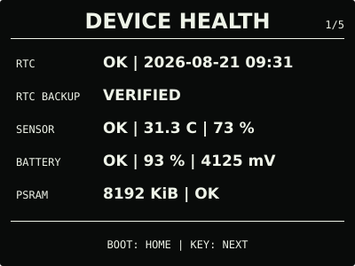
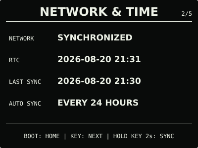
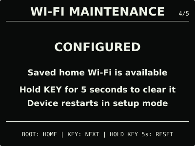
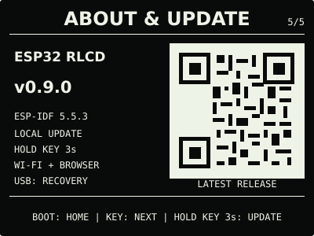

# ESP32 RLCD Firmware v0.9.0

这是由本项目源码及固定开源依赖构建，并在 Waveshare ESP32-S3-RLCD-4.2 实机完成
无网络配置离线运行、配网窗口超时、重新配网、NTP 校时和重启恢复验收的正式发布物。

| 首屏 | 月历 |
| :---: | :---: |
|  |  |
| 设备健康 | 网络与时间 |
|  |  |
| 音频诊断 | Wi-Fi 维护 |
|  |  |
| 关于与更新 | 本地升级入口 |
|  |  |

> 效果图按 400 × 300 实机布局和代表性数据绘制，采用黑色背景、白色像素。全反射屏的
> 实际观感会随环境光变化。

## 选择固件

| 文件 | 用途 | 大小 | SHA-256 |
| --- | --- | ---: | --- |
| `esp32-rlcd-firmware-v0.9.0-factory.bin` | 首次安装、v0.6.0 及更早版本迁移、故障恢复 | 1,425,280 bytes | `158e41d6201f92811c8f09f025766cdbd010eb0c7d923e3878d5e0d12cc0a6a6` |
| `esp32-rlcd-firmware-v0.9.0-ota.bin` | 已安装 v0.7.0+ 后的日常本地升级 | 1,359,744 bytes | `697cbef186e9925005e27dfbec1fa89c6e358742f0240588c7c9d32b93d68acd` |

Factory 镜像从 `0x0` 写入，包含 Bootloader、分区表和应用，并会清除 NVS；OTA 镜像只
包含应用，通过设备本地升级网页写入，不会清除已保存的家庭 Wi-Fi。两种文件不能互换。

## 本版本功能

- 网络不可用时保留 RTC 首屏、月历、温湿度、电量、系统中心和音频等全部本地功能；
- 已保存网络连接失败后不清除凭据、不自动开放热点，后台按 1、5、15、60 分钟退避；
- Wi-Fi、NTP 和网络服务失败分别记录，可在“网络与时间”页主动重试；
- 首次或主动重配网的二维码 60 秒后退出，临时热点最多开放 5 分钟；
- 可按 `BOOT: OFFLINE` 立即返回首屏；没有家庭网络配置时仍可主动开启本地 OTA。

空白网络配置、热点超时、重新配网、NTP 与重启恢复已经实机验证。保存凭据但路由器不可达
的完整小时级退避、家庭 Wi-Fi 可达但 NTP 不可达，以及无家庭网络时的本地 OTA 尚未分别
进行专项实机测试；对应状态策略均有主机逻辑测试覆盖。

## 安装使用

首次安装或从 v0.6.0 及更早版本迁移时使用 Factory 镜像：

```bash
cd dist/v0.9.0
sha256sum --check SHA256SUMS
cd ../..
./scripts/flash.sh --port COM5 \
  --firmware dist/v0.9.0/esp32-rlcd-firmware-v0.9.0-factory.bin \
  --confirm
```

已经安装 v0.7.0 或更新版本时，下载 `-ota.bin`，在“关于与更新”页按住 `KEY` 3 秒；
扫描屏幕二维码连接临时热点，在没有自动打开网页时访问 `http://192.168.4.1`，上传 OTA
文件并等待设备校验、重启。该路径保留家庭 Wi-Fi 配置。

完整步骤和故障恢复见[发布固件安装指南](../../docs/user-install.md)与
[固件安装与本地升级](../../docs/firmware-update.md)。本版本使用 ESP-IDF v5.5.3
（`2c211b236707889e8400c4dc5644dd5c4ee071e0`）构建，日期为 2026-08-22；实机验证记录见
[实机验证记录](../../docs/bringup-log.md)。许可证与第三方声明见
[`LICENSE`](../../LICENSE)、[`NOTICE.md`](../../NOTICE.md) 和 [`LICENSES/`](../../LICENSES/)。
