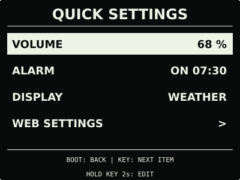

# 设备设置

设备端快捷设置与常驻显示从 **v0.26.0 Beta** 开始提供，尚未进入正式版。
v0.25.0 及更早版本在“设置”页长按 `KEY` 3 秒直接打开网页设置。

## 快捷设置

短按 `KEY` 切到 `SETTINGS`，按住 `KEY` 3 秒后松开，进入 `QUICK SETTINGS`。
这里仍属于“设置”，不会增加系统页面数量。

| 项目 | 可以调整的内容 |
| --- | --- |
| `VOLUME` | 播放音量，0% 为静音；修改时按 10% 档位循环 |
| `ALARM` | 开启或关闭已有闹钟；同时显示已保存的时刻和重复日期 |
| `DISPLAY` | 常驻显示：时钟、已启用的天气、有有效图片的 microSD 图片页 |
| `WEB SETTINGS` | 打开手机网页，配置 Wi-Fi、API Key、闹钟时间或进行本地 OTA 等 |

菜单中短按 `KEY` 选择下一项，按住 2 秒进入编辑，短按 `BOOT` 返回。
编辑时短按 `KEY` 修改，按住 2 秒保存；短按 `BOOT` 取消本项编辑。
修改只有在明确保存后才生效，不需要重启，也不会为普通设置开启热点。

音量原来不是整十数值时，会先显示原值；第一次修改才进入整十档位。
闹钟的时刻与重复日期仍在网页中设置，默认是关闭的工作日 07:30；启用前请确认 RTC
时间正确。音量为 0% 时闹钟只有屏幕提醒。

保存失败会保留候选值，可再次保存或取消；已经保存但暂不能应用时显示
`SAVED | APPLYING`，后台会重试。30 秒无操作或闹钟响起时取消未保存的编辑。

## 常驻显示

在 `DISPLAY` 中选好并保存后，设备立即展示该页；正常开机和其他普通页面无操作
30 秒后也回到它。选中的常驻页可以一直显示，不自动轮播。

- `CLOCK`：默认时钟，升级旧版后仍使用此项。
- `WEATHER`：需要先在网页开启天气；断网时保留同地点缓存，并显示缓存时间与过期状态。
- `IMAGE`：需要有可读取的 microSD 图片；显示上次选中的一张，多图仍可短按 `KEY` 切换。

天气关闭、图片不可用时回到时钟，但不清除常驻偏好。设置时跳过不可用选项；要启用天气
或导入图片，可使用下方网页设置。microSD 插拔仍需关机后进行。

日常页面切换顺序不变，`BOOT: HOME` 与语音“主界面”仍回到时钟；若常驻设置不是
时钟，30 秒无操作后会回到所选常驻页。恢复模式不使用此偏好。

## 网页设置

- **v0.26.0 Beta**：`SETTINGS` 按住 `KEY` 3 秒 → 松开 → 短按 `KEY` 选中
  `WEB SETTINGS` → 按住 `KEY` 2 秒。
- **v0.25.0 及更早版本**：`SETTINGS` 按住 `KEY` 3 秒，直接打开。
- **启动恢复模式**：保持原操作，`SETTINGS` 按住 `KEY` 3 秒打开精简恢复门户。

看到二维码后连接屏幕显示的热点，未自动打开网页时访问 `http://192.168.4.1`。
普通设置热点最长开放 5 分钟，短按 `BOOT` 可以关闭；本地 OTA 已开始写入时不能中断。
热点开启期间家庭 Wi-Fi 暂停，关闭后按当前电源状态恢复。

详细说明：[固件安装与更新](firmware-update.md)、[天气配置](weather.md)、
[AI 对话配置](cloud-voice.md)、[microSD 图片管理](microsd-images.md)。
