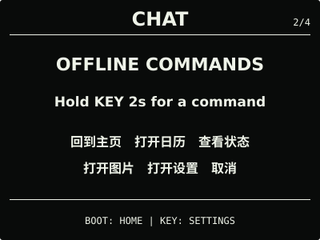
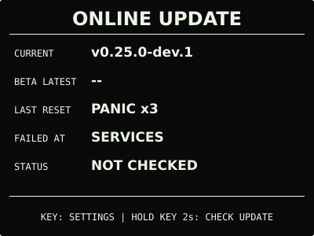
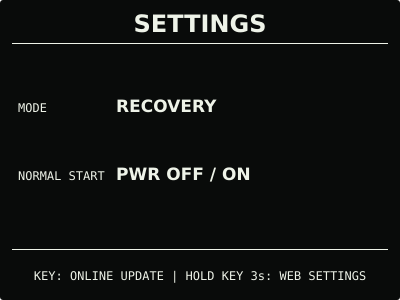

# 界面与按键

固件把屏幕内容分为“日常功能”和“系统中心”两条路径。日常页面只保留高频信息；版本、
诊断和维护操作集中到系统中心，避免两个实体键在不同页面承担难以预测的含义。完整设计
原则见[产品界面与交互设计规范](design-guidelines.md)。

本文记录当前源码的页面与交互；正式发布版本与安装方式见
[固件安装与更新](firmware-update.md)。

```text
日常功能（BOOT）
  首屏 [-> 天气（已启用时）] -> 月历 [-> 图片（仅有效图片时）] -> 循环

系统中心（KEY）
  状态 -> 对话 -> 设置 -> 在线更新 -> 循环

到点提醒
  闹钟（结束后恢复原页面）

启动恢复（连续异常启动或开机按住 KEY）
  在线更新 <-> 设置
```

只有已配置并开启天气时才加入天气页；只有在开机时从 microSD 成功读到有效图片后才加入
图片页。两项都不可用时，日常页面环为“首屏 → 月历 → 首屏”。

## 实体按键

| 按键 | 日常页面 | 系统中心 |
| --- | --- | --- |
| 短按 `BOOT` | 切换到下一日常页；天气和图片按可用状态加入 | 返回首屏 |
| 短按 `KEY` | 主界面、天气和日历进入“状态”；多图图片页切换下一张，单图图片页进入“状态” | 切换到下一系统页 |
| 长按 `BOOT` | 无运行时操作 | 仅在“设置”页按住 2 秒切换手动提前省电；其他系统页无操作 |
| 长按 `KEY` | 天气页按住 2 秒刷新；图片页按住 2 秒进入当前图片的删除确认；其他日常页无操作 | 仅执行当前页面明确提示的操作 |
| `PWR` | 短按开机，长按关机 | 同左 |

稳态页脚直接写出按键将到达的目的地或完成的动作，不使用脱离上下文的 `PAGE`、裸
`NEXT`、`SYSTEM` 或 `PORTAL`。可选页面会按当前状态显示唯一真实目的地：

| 页面或条件 | 页脚文案 |
| --- | --- |
| 天气 | `BOOT: CALENDAR | KEY: STATUS | HOLD KEY 2s: REFRESH` |
| 月历（存在有效图片） | `BOOT: IMAGE | KEY: STATUS` |
| 月历（无有效图片） | `BOOT: HOME | KEY: STATUS` |
| 图片（多图） | `BOOT: HOME | KEY: NEXT IMAGE | 2/6`；第二行 `HOLD KEY 2s: DELETE IMAGE` |
| 图片（单图） | `BOOT: HOME | KEY: STATUS`；第二行 `HOLD KEY 2s: DELETE IMAGE` |
| 状态 | `BOOT: HOME | KEY: CHAT | HOLD KEY 2s: SYNC TIME` |
| 对话（空闲或不可用） | `BOOT: HOME | KEY: SETTINGS` |
| 设置 | `BOOT: HOME | KEY: ONLINE UPDATE`；第二行按当前请求显示 `MANUAL SAVING ON` 或 `MANUAL SAVING OFF`，并使用 `WEB SETTINGS` |
| 在线更新 | `BOOT: HOME | KEY: STATUS`；可操作时追加 `CHECK UPDATE` 或 `REVIEW UPDATE` |

所有有效长按在持续 1 秒后统一显示剩余时间与 `RELEASE TO CANCEL`；此时提前松开只取消
长按，不会再执行短按动作。天气、月历、图片和所有系统页无操作 30 秒后返回首屏。长按中的按键、
图片删除确认与执行、
语音会话、校时任务、设置门户和固件更新会暂停普通页面超时。图片删除确认页必须先松开
发起长按的 `KEY`，再短按 `KEY` 删除；短按 `BOOT` 或 10 秒无操作取消。语音监听时，
屏幕明确显示的 `KEY: DONE` 与 `BOOT: CANCEL` 临时取代页面导航；AI 回复播放中
可按 `KEY` 跳过并续问，`FOLLOW-UP` 中用 `KEY` 续问、`BOOT` 结束。在线更新检查、连接和
确认阶段也可按 `BOOT` 取消。操作结束后恢复表格中的普通语义。


闹钟到点时会临时覆盖当前页面，并优先接管两个按键：


- 短按 `BOOT` 停止本次提醒；
- 首次响铃可短按 `KEY` 延后 5 分钟一次，延后期间立即恢复此前页面；
- 延后后的第二次响铃只允许 `BOOT` 停止；未操作时每次响铃最多持续 60 秒；
- 提醒出现前已经按住的键必须先松开，避免原本的页面长按被误判为停止或延后。

闹钟使用 PCF85063 的本地时间和星期，断网、无互联网及实际 `SAVING` 状态均不影响已保存的
规则。RTC 无效或设备错过目标分钟时不补发；短期日期回拨不会重复提醒，明显异常的远未来
记录也不会让闹钟长期失效。物理关机后 ESP32 与扬声器没有供电，因此关机期间不会响，也
不会在下次开机补发。RTC 备用电池只能维持走时，不能唤醒设备。

关机后“按住 `BOOT`，再短按 `PWR`”仍用于进入 ESP32-S3 ROM 下载模式。此时应用固件
没有运行，屏幕不会绘制烧录进度；它与正常运行时的 `BOOT` 页面切换是两种不同场景。
正常运行时通过在线更新或设置门户写入固件时，应用仍在运行，因此屏幕可以显示真实进度。
开机时按住 `KEY` 则进入应用提供的恢复模式，屏幕和恢复更新入口仍可使用；两种恢复方式
不要混淆。

## 首屏


400 × 300 首屏采用黑底白字三段式布局：

- 顶部显示公历日期、无“农历”前缀的农历月日、星期，以及当前 Wi-Fi 连接与电池状态组；
  四组按实际宽度分配相等间距，状态组使用固定占位，避免内容跳动；
- 实际 `NORMAL` 状态在中部以同一种 78 像素数字字体等大显示 `HH:MM:SS`；实际 `SAVING`
  状态显示 `HH:MM` 并按分钟刷新。自动低电规则始终按电量在两种状态间选择，用户也可
  手动提前进入省电；两种布局的字形视觉中心都位于整屏中央；
- 底部只显示温度、三态环境舒适度线稿脸和湿度。温湿度使用 20 像素字体，分别以左右
  半屏为中心；温度单位可在设置门户选择摄氏度或华氏度；
- 固件版本、传感器诊断、原始电压和网络错误码不进入首屏。

舒适度提示同时考虑温度和湿度，并以较差的一项决定状态：

| 状态 | 判定范围 | 图形 |
| --- | --- | :---: |
| 舒适 | 20—26 ℃ 且 40—60% RH | 笑脸 |
| 一般 | 未达到舒适，但仍在 16—28 ℃ 且 30—70% RH | 平脸 |
| 需调整 | 任意一项超出一般范围 | 皱脸 |

该分档是适合本项目的室内环境提示，不是健康结论或标准合规判定。首个有效温湿度样本会
立即显示数值和对应表情；此后的状态使用最近约一分钟的有效读数减弱瞬时波动，并在边界
加入约 0.5 ℃、3% RH 的滞回。经过窗口滤波后，较差的新状态还需持续约 30 秒，恢复到
更好状态还需持续约两分钟才切换。一次读取失败会先触发一次传感器恢复重试；重试仍失败
时，首屏继续显示最近有效数值和表情，满 180 秒没有新样本后才改用占位符并隐藏表情。
日常显示数值同样使用近一分钟有效样本的中位数，并只在屏幕可见精度变化时刷新；判定
始终使用摄氏原始值，不受显示温标影响。
湿度默认范围参考 [EPA 室内空气指南](https://www.epa.gov/indoor-air-quality-iaq/care-your-air-guide-indoor-air-quality)，
同时遵循 [ASHRAE Standard 55](https://www.ashrae.org/technical-resources/bookstore/standard-55-thermal-environmental-conditions-for-human-occupancy)
所说明的人体热舒适还取决于风速、衣着与活动等因素。

完整 Wi-Fi 图标只表示设备当前已连接家庭 Wi-Fi 并取得 IPv4 地址，不代表互联网或 NTP
一定可用。未连接、正在连接、连接失败、配网 SoftAP 和实际 `SAVING` 空闲时均留空，不画
离线斜杠；图标槽位仍固定保留，因此电池和日期不会随连接变化移动。实际 `NORMAL` 在
已有凭据时保持家庭 Wi-Fi 连接，因此图标通常常驻；即使 NTP 不可达，只要当前 IPv4 仍
有效就继续显示。历史同步与错误由“状态”页承载。实际 `SAVING` 不自动联网，手动校时、
在线更新和图库下载只在操作期间临时开启 Wi-Fi。蓝牙尚未启用，因此不显示蓝牙图标。

农历在设备上离线换算，覆盖 2000—2099 年并支持闰月。温湿度来自板载 SHTC3，代表设备
附近环境，不是联网天气；充电、持续联网和板上器件发热可能使读数与房间其他位置存在
差异。电池百分比由 GPIO4 采样电压估算，不是电量计提供的真实荷电状态，受充电、负载和
电芯老化影响。插入 USB 后端电压可能立即抬升，拔线后也可能立即回落；这类百分比变化不
代表电池瞬间充入或失去对应容量。确认连接电脑 USB 数据主机时，首屏以 `USB` 替代电池
百分比，“状态”页只显示 `USB` 与端电压，避免把被抬高的读数冒充剩余容量。原板不能
识别普通充电器、充电宝或纯充电线，这些场景仍可能显示随端电压跳动的近似百分比，也不会
显示可靠的充电或外部供电标识。

## 天气


天气页顶栏显示城市、RTC 当前日期和星期，中间是室外实况与三日预报，底部单独显示
QWeather 数据获取的月日、时间和过期状态。断网时日期仍按 RTC 更新，不把缓存时间当成
当前时钟；RTC 无效时日期使用占位符。天气不替代首屏的板载室内温湿度。配置开启后才加入
`BOOT` 日常页面环；请求中、首次失败和缓存过期都保留同一布局，不用临时文字页打断页面。

在天气页按住 `KEY` 2 秒可立即刷新；正在刷新时不会重复排队。`NORMAL` 复用家庭 Wi-Fi，
`SAVING` 只为本次操作临时联网并在结束后关闭无线。同地点获取失败时保留最后一次成功
缓存。凭据配置、自动刷新间隔和故障排查见[天气 Beta](weather.md)。

## 月历


月历显示 RTC 当前月份，以星期一为每周首日，并用实心圆反色突出今天。顶部显示当月、
当天农历、星期和当前时分。当前版本不提供历史月份翻阅，避免两个按键承担额外模式。
存在有效图片时，月历页脚显示 `BOOT: IMAGE`；没有有效图片时显示 `BOOT: HOME`。
`KEY` 始终前往状态页，屏幕不会同时列出两个可能目标。

## microSD 图片


图片页是可选的第三个日常页面。固件开机时使用 ESP-IDF 原生 1-bit SDMMC
读取 FAT32 microSD，并将固定目录 `/rlcd/images/` 中排序最前的最多 32 张有效图片
缓存到 PSRAM。屏幕不显示文件名、路径、容量或诊断码。

首选格式是二进制 PBM P4，另外只接受尺寸、位深、压缩和调色板都符合限定的 1-bit
BMP 子集。两种格式都必须是 400 × 300 纯黑白像素。底部 50 像素由固件保留并重画
操作提示，因此主要图像内容应放在顶部 400 × 250 区域。多图时显示
`BOOT: HOME | KEY: NEXT IMAGE | 2/6` 一类提示，单图时显示
`BOOT: HOME | KEY: STATUS`；两种情况都明确提示 `HOLD KEY 2s: DELETE IMAGE`。

多图时短按 `KEY` 立即查看下一张，选中的图片会一直显示并跨重启保留；固件不按小时、
日期或其他周期自动换图。无论卡中有多少张图，日常页面环仍只保留一个图片页。

图片页持续按住 `KEY` 1 秒会出现继续按住提示，满 2 秒进入当前图片的单张删除确认，
不会直接写卡；进入后必须先完整
松开 `KEY`，再短按 `KEY` 删除，短按 `BOOT` 或等待 10 秒取消。删除由异步任务执行；
成功或失败结果至少保持 2 秒；成功后显示下一张，删除末张后回到首张，删除最后一张后
图片页隐藏，失败则
保留原文件、当前图片和运行时目录。首版不提供批量删除。


设置门户仍可在手机浏览器中本地将 JPEG/PNG 转换、二值化并预览为
400 × 300 PBM，用户确认后才将最终 PBM 写入 microSD，原图不会离开手机；
也可在已配置 Wi-Fi 时主动从 `mcu.taifua.com` 下载 6 张公共演示图。设置门户还提供单张
预览、设为当前和二次确认删除；固件不自动格式化、覆盖或批量清理文件。导入、选择和
删除完成后直接更新运行时目录，无需重启。

microSD 不用于保存音频或其他运行数据。必须物理关机后再插卡、拔卡或换卡；
运行中插入的卡需要重新开机才会识别。无卡时图片页隐藏，设置门户的图片入口显示
为不可用，但不影响其他页面或设置。完整准备、导入和故障排查见
[microSD 图片](microsd-images.md)。

## 系统中心

四个系统页共用标题、`1/4`—`4/4` 位置、内容网格和底部按键提示，每页只负责一类问题：

| 页面 | 内容 | 当前页长按操作 |
| --- | --- | --- |
| 状态 | RTC 与备用电源、SHTC3、电池、最近时间同步结果和当前 Wi-Fi 链路 | 按住 `KEY` 2 秒立即校时 |
| 对话 | 本地安全指令，以及可选 AI 对话 Beta 的连接、转写、回复与续问 | 按住 `KEY` 2 秒，松开后开始一次会话 |
| 设置 | 实际电源状态与原因、手动提前省电、时区、温度单位、播放音量、离线闹钟和本地设置门户 | 按住 `BOOT` 2 秒切换手动提前省电；按住 `KEY` 3 秒开启设置门户 |
| 在线更新 | 当前版本、对应通道最新版本和最近检查结果 | 按住 `KEY` 2 秒检查或查看可用版本；确认页按住 3 秒安装 |

| 状态 | 对话 |
| :---: | :---: |
|  |  |
| 设置 | 在线更新 |
|  |  |

“状态”页保持五行：`RTC` 合并当前可用性和备用电源结果，`SENSOR` 与 `BATTERY` 显示
本地硬件状态，`TIME SYNC` 显示最近同步结果或时间，`WI-FI` 单独显示当前链路。
温湿度瞬时读取失败但最近有效样本尚未满 180 秒时，`SENSOR` 保留数值并标记 `STALE`；
满 180 秒仍未恢复才显示 `READ ERROR`。
Wi-Fi 使用 `CONNECTED`、`CONNECTING`、`OFFLINE | RETRY`、`OFFLINE`、
`OFF | SAVING`、`NOT CONFIGURED` 或 `NOT READY`，不会把历史同步或已保存凭据冒充为
当前连接。

在“状态”页发起校时后会显示启动 Wi-Fi、连接和等待 NTP；写入并回读 RTC 成功后显示
结果，再返回该页。即使实际 `NORMAL` 正在离线退避，或实际 `SAVING` 已关闭自动联网，
手动操作也可立即重试；未保存 Wi-Fi 或网络任务忙碌时只提示不可用，不修改配置。

`RTC` 行中的备用电源结果不显示电压：开发板没有把 RTC 电池接入 ESP32 ADC。首次运行显示
`UNTESTED`；固件保存一次 RTC 时间标记，下一次真实断电开机时在联网前检查 PCF85063
停振标志和时间变化，通过后显示 `VERIFIED`，曾丢失有效时间则显示 `FAILED`。该结果只
证明最近一次断电保持成功，不估算电池容量或剩余寿命。

“对话”页只在用户主动操作后采集。AI 模式空闲时显示 `Hold KEY 2s to ask`，本地模式
显示 `Hold KEY 2s for a command`；前者说明目标是提问，后者说明只接受设备指令。
按住 `KEY` 2 秒进入会话，看到 `RELEASE KEY` 后
松开再开始说话；监听时短按 `KEY` 提前结束，连接、监听、识别、思考或播放阶段短按
`BOOT` 取消。AI 回复播放完成后，续问页中短按 `KEY` 继续、短按 `BOOT` 结束；
轮次未满时，播放中使用 `KEY: NEXT TURN` 会先跳过剩余回复，短暂显示 `NEXT TURN` 后再开始
下一轮。设备不使用唤醒词，也不会在空闲时持续监听。



AI 对话已开启、已保存 API Key、实际状态为 `NORMAL` 且家庭 Wi-Fi 当前取得 IPv4 时，
设备会直连阿里云百炼 Realtime，在同一 WebSocket 上保留服务端上下文，
最多进行 5 轮中英文问答。每轮语音输入最长 10 秒，回复后续问等待最长 30 秒，
对话开始 5 分钟后不再接受新问题；已经开始的回答会完整播放。回答默认简短，回复文字在
本页按实际字体宽度换行，并跟随扬声器播放进度持续显示最新 4 行。默认使用
`qwen3-omni-flash-realtime`，高级设置可选择 `qwen-audio-3.0-realtime-flash`。家庭
Wi-Fi 离线、设备处于 `SAVING`、云端已停用或未配置 Key 时，本轮自动使用最长 5 秒的本地
MultiNet 指令识别，不会停在云端连接页等待网络。后端在整段会话开始时确定；
会话结束后不跨次保留上下文。配置、上传数据、凭据和可能费用见
[AI 对话 Beta](cloud-voice.md)。

本地模式支持“回到主页”“打开日历”“查看状态”“打开图片”“打开设置”和“取消”。这些
指令只负责页面导航：不会安装固件、清除 Wi-Fi、开启热点、删除图片、修改设置、切换
省电状态或控制闹钟；没有有效图片时“打开图片”不会跳转。未知、低置信度或已经取消的
结果不执行动作。

本地识别使用板载 ES7210 麦克风和设备 Flash 中的 ESP-SR 中文模型，不需要 Wi-Fi、互联网、
扬声器或 microSD，在 `SAVING` 状态也可由用户主动发起。没有唤醒词，不会在空闲时持续
监听。原始 PCM 只临时存在易失内存，不写入 Flash、NVS、microSD、USB 日志或网络；
结束、取消或失败后清理。原来的扬声器与双麦克风回环测试保留为开发和维护诊断，不再
占用系统中心实体按键流程。

云端回复只展示和播放，绝不会作为设备命令执行。AI 模式会把各轮 PCM 发送到阿里云百炼，
但同样不在设备 Flash、NVS、microSD 或日志中保存语音和回复。

模型缺失、损坏或麦克风不可用时，页面显示 `CHAT UNAVAILABLE`，RTC、首屏、月历、
闹钟和更新等其他功能继续运行。v0.18.0 首次安装模型的方式见
[发布固件安装指南](user-install.md)。

“设置”页显示实际电源状态及原因、手动提前省电、时区、温度单位、播放音量和闹钟摘要。
`POWER` 使用 `NORMAL`、`NORMAL | USB`、`SAVING | MANUAL` 或
`SAVING | LOW BAT`，不再显示单独的自动配置项。按住 `BOOT` 2 秒只切换并保存
“手动提前省电”的开与关，随后在原地应用，不需要开启热点；关闭手动请求不等于强制
`NORMAL`，低电规则仍可能保持 `SAVING | LOW BAT`。应用完成后显示成功，暂时无法应用时
显示等待重试。第二行页脚显示的是下一次长按会执行的 `MANUAL SAVING ON` 或
`MANUAL SAVING OFF`，而不是重复当前状态。按住 `KEY` 3 秒的 `WEB SETTINGS` 会开启
最多 5 分钟的临时 WPA2 设置门户，屏幕显示标准 Wi-Fi 二维码、随机密码和
`192.168.4.1`：

若保存已经完成但运行态暂时无法切换，`POWER` 行显示手动目标与 `PENDING`，后台继续
重试；下一次设备端操作仍从已经保存的开关状态继续。


手机页面不重复提供手动省电开关，只修改 UTC 偏移、温度单位、播放音量、单个每周闹钟和
更新通道，也可使用手机时间校准 RTC、查看与更换已保存 Wi-Fi、管理 microSD 图片、
恢复偏好默认值或上传本项目的 OTA 镜像。门户期间家庭 Wi-Fi 暂停，页面显示的是“已保存网络”，
不是当前连接；密码输入框始终留空，不回传、预填或记录。更换时，候选凭据只在内存中验证，
取得 IPv4 后才写入 NVS；失败时保留旧配置和门户，成功时关闭门户并按当前实际状态恢复：
`NORMAL` 使用新网络校时并保持连接，`SAVING` 完成本次主动校时后关闭无线，不重启设备。
没有修改网络时直接关闭门户也遵循同一规则。“清除 Wi-Fi”仍为需要单独确认的忘记网络
操作，不是更换网络的必经步骤。

自动低电规则始终生效：冷启动首个有效电量不高于 20% 时进入 `SAVING`，
否则进入 `NORMAL`；运行期在不高于 20% 或不低于 25% 的一侧连续取得两次有效采样后才
切换，无效读数保持当前状态。连接 USB 数据主机时立即使用 `NORMAL`，不再检测到主机后
以新鲜电量读数重新判断。原板没有向 ESP32 提供 VBUS 或充电状态，因此普通充电器、充电宝
和纯充电线不能触发这项 USB 数据检测，仍按电量阈值运行。手动请求和实际状态立即热应用，
无需重启，也不会中断已经开始的手动联网、OTA 或其他操作。实际 `NORMAL` 使用 ESP-IDF
`WIFI_PS_MIN_MODEM` 保持家庭 Wi-Fi 连接；实际 `SAVING` 不保持连接，主动网络事务完成后
再关闭无线。
Beta 更新默认
关闭，只有能使用本地 OTA 或 USB 恢复设备的开发者主动确认后才加入测试通道；关闭后
立即恢复检查稳定版，但不会自动降级已安装固件。保存偏好和恢复默认值会在主任务中
立即应用，热点与网页保持连接；清除 Wi-Fi 不删除其他偏好，也不重启设备，但设置热点
会关闭并切换为配网热点，手机需要按屏幕提示重新连接。等待连接或普通配置时可短按
`BOOT` 关闭门户，开始接收固件后按键不会中断 Flash 写入。本地 OTA 不依赖互联网，完整
步骤见[固件安装与更新](firmware-update.md)。

设置门户另外提供可选的 microSD 图片管理。无卡时相关操作不可用但其他表单仍可正常使用；
手机本地导入不需要互联网，
公共演示图下载需要设备已保存可用 Wi-Fi。

“在线更新”显示 `NOT CHECKED`、`CHECKING`、`UP TO DATE`、`UPDATE AVAILABLE` 或
`FAILED`。无可用版本时页脚显示 `CHECK UPDATE`；已有可用版本时改为 `REVIEW UPDATE`。
按住 `KEY` 2 秒检查或进入 `REVIEW` 确认页，核对
目标版本后再按住 `KEY` 3 秒才开始安装。实际 `NORMAL` 状态的自动联网只检查，不会弹出
页面或静默安装，并复用保持中的家庭 Wi-Fi 连接；实际 `SAVING` 状态不自动检查，手动
检查和安装时临时连接。两种状态下安装都必须明确确认。
测试通道时第二行标为 `BETA LATEST`。检查、连接和确认阶段
可按 `BOOT` 取消，开始下载并写入 Flash 后按键不得中断。

除天气页、图片页和屏幕明确提示长按操作的系统页外，其他页面长按 `KEY` 不会执行隐藏动作；
除“设置”页外，正常运行时长按 `BOOT` 同样没有隐藏动作。长按松开后不会被误判为短按。

## 启动恢复

<p>
  
  
</p>

同一应用镜像在完成健康判定前连续发生 3 次异常复位后，下一次启动会进入
`RECOVERY MODE`。
应用还能启动时，也可在开机期间按住 `KEY` 主动进入。恢复页显示最近复位原因、连续次数
和上次启动阶段，帮助判断故障位置；这些记录只保存在 RTC 保留内存，正常断电后不会形成
永久锁定。

恢复模式刻意只保留两页：

| 页面 | 操作 |
| --- | --- |
| 在线更新 | 按住 `KEY` 2 秒检查或查看版本；安装仍需在确认页按住 3 秒 |
| 设置 | 按住 `KEY` 3 秒开启精简恢复门户 |

短按 `KEY` 在两页间切换，不显示普通系统中心的 `1/4`—`4/4` 编号；`BOOT` 不返回首屏，
30 秒页面超时也停用。精简门户只提供已保存 Wi-Fi 的查看、更换、清除，以及本地 OTA；
不会开放偏好、天气、AI 对话、图片、手机校时或恢复默认值。恢复模式也不启动天气、音频、
microSD、温湿度和闹钟服务。自动恢复时若实体按键不可用，设备会直接开放精简门户。

恢复模式不自动开启普通配网热点；没有保存 Wi-Fi 时也能进入精简门户并上传 OTA。
恢复门户没有普通设置的 5 分钟截止时间，可由 `BOOT` 关闭，升级或更换网络时按流程结束。

修复完成后，按屏幕提示关闭电源，不按 `KEY` 正常开机。若应用恢复模式无法进入，才使用
“按住 `BOOT` 再按 `PWR`”进入 ROM 下载模式并写入 Factory 固件。完整步骤见
[固件安装与更新](firmware-update.md)。

## 异常状态

- RTC 无效时首屏按当前模式使用 `--:--:--` 或 `--:--`，并显示日期占位符；温湿度、
  电量、系统中心和本地语音仍可使用，自动连接、NTP 失败和后台重试不显示全屏错误；
- 仅首次配置或用户在设置门户清除网络配置后显示配网二维码；这是省电联网规则的例外，即使
  实际处于 `SAVING` 也会开放临时热点。二维码显示 60 秒后恢复首屏，
  临时热点最多继续开放 5 分钟，也可按屏幕提示的 `BOOT: OFFLINE` 立即回到首屏；
- microSD 未插入、不是 FAT32、目录不存在或没有有效图片时，不显示启动错误或空白图片
  页；`BOOT` 保持在首屏与月历之间切换，RTC、传感器和系统中心不受影响；
- 温湿度从未取得有效样本，或最近有效样本已满 180 秒仍未更新时，在原位置显示 `--`；
  瞬时读取失败保留最近有效结果，不让首屏数据和表情闪烁；电池不可用时保留空图标并
  显示 `--%`；
- 系统页使用 `NOT FOUND`、`READ ERROR`、`NOT CONFIGURED` 等短状态，详细错误码只写入
  USB 日志。
- 同一镜像在 60 秒健康门槛前连续异常复位 3 次后，下一次启动进入恢复，不再反复初始化
  全部功能；正常断电、固件更新的计划内重启和新应用镜像不会继承旧故障计数。

## 数据与设计参考

- 农历月界以[香港天文台公历与农历对照表](https://www.hko.gov.hk/sc/gts/time/conversion.htm)
  为校验依据；
- 电池采样电路与实体按键依据[微雪 ESP32-S3-RLCD-4.2 文档](https://docs.waveshare.net/ESP32-S3-RLCD-4.2/)；
- 页面层级、浅导航和实体按键语义参考 Apple 与 Garmin 的官方指南，具体链接集中在
  [设计规范](design-guidelines.md#参考原则)。
