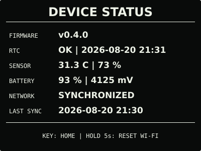

# 首屏信息与布局规范

首屏面向日常查看，不承担硬件调试和版本诊断。画布为 400 × 300 黑底白字单色横屏，
信息优先级依次为时间、日期与农历、电池和本地温湿度。正常运行时短按 `BOOT` 可在
首屏、月历和固件信息三个主页面之间循环。

```text
┌────────────────────────────────────────┐
│ 2026年8月18日  七月初六  星期二  Wi-Fi ▰ 93%│
│                                        │
│              21:31:12                  │
│                                        │
├────────────────────────────────────────┤
│      31.3 °C         ♥         73 %     │
└────────────────────────────────────────┘
```

README 中的 [SVG 效果图](assets/home-screen.svg)使用同一布局和代表性数据绘制，并按
实机的黑色背景、白色像素显示极性呈现。

## 显示规则

- `HH:MM:SS` 使用同一种 78 像素数字字体，秒数不缩小。
- 顶部依次显示公历年月日、无“农历”前缀的农历月日、中文星期，以及 Wi-Fi 与电池组成
  的设备状态组；根据四组内容的真实宽度，把剩余空间平均分成三个间隔。状态组保留固定
  宽度，避免电量百分比或网络状态变化造成其他内容跳动。
- 完整 Wi-Fi 图标表示本次启动已成功完成网络校时，并不表示射频始终开启；下半层图标
  表示正在连接或校时，带单条斜杠的图标表示尚未配置或最近一次连接失败。蓝牙尚未启用，
  因此不显示蓝牙图标。
- Wi-Fi 图标使用固定的 18 × 14 像素格和约 2 像素实心笔画，顶边与 14 像素高的电池框
  对齐；所有状态保持相同占位。这样可避免原先 1 像素圆弧偏轻、双叉过密，以及状态切换
  引起首行重新排版。
- 农历离线换算，不依赖 Wi-Fi；覆盖 PCF85063 支持的 2000—2099 年并支持闰月。
- 首栏和底栏均为 56 像素高；中间时间栏为 188 像素高。大时间的字形视觉中心固定在
  整屏中心 `y=150`，而不是只按字体基线或旧分隔线居中。
- 温湿度来自板载 SHTC3，代表设备附近环境，不等同于联网天气数据。
- 温湿度使用 20 像素数字字体，只显示数值和单位；温度以左半屏 `x=100` 为中心，湿度
  以右半屏 `x=300` 为中心，静态实心心形固定在整屏中心 `x=200`，不显示竖线。
- 电池百分比由 GPIO4 电压采样估算；首屏不显示原始电压。
- 固件版本、构建信息和硬件状态不出现在首屏；短按板载 `KEY` 可进入独立设备状态页。

## 月历页

首屏短按一次 `BOOT` 进入当月月历；今天使用实心圆反色突出，顶部显示当月、当天农历、
星期和当前时分。月历采用星期一作为每周首日，与中国大陆常用日历排列一致。


月历只显示 RTC 当前月份，不提供翻阅历史月份，避免两个实体按键承担过多模式。页面保持
30 秒后自动回到首屏；再次短按 `BOOT` 会直接进入固件信息页。

## 固件信息页

月历页再次短按 `BOOT` 进入固件信息页，显示当前运行版本、GitHub 最新 Release 二维码和
USB 烧录的物理按键提示；再按一次返回首屏。


该页面是正常运行固件绘制的信息页，不是 ESP32-S3 ROM 下载器。真正进入下载模式仍需
关机后按住 `BOOT` 再按 `PWR`；此时应用没有运行，屏幕不会显示烧录进度。固件信息页同样
在 30 秒无操作后返回首屏。

正常运行时按住 `BOOT` 2 秒会请求一次即时 SNTP 校时，依次显示启动 Wi-Fi、连接和等待
NTP；写入并回读 RTC 成功后显示 `TIME SYNCED`，随后返回原页面。未配置 Wi-Fi 或网络任务
正在执行其他操作时只提示不可用，不修改现有配置。

## 设备状态页

状态页用于偶尔检查设备，不改变首屏的信息层级。短按 `KEY` 进入，再次短按立即返回；
没有操作时 15 秒后自动返回首屏。



```text
┌────────────────────────────────────────┐
│              DEVICE STATUS             │
├────────────────────────────────────────┤
│ FIRMWARE      v0.5.0                   │
│ RTC           OK | 2026-08-20 21:31    │
│ SENSOR        31.3 C | 73 %            │
│ BATTERY       93 % | 4125 mV           │
│ NETWORK       SYNCHRONIZED              │
│ LAST SYNC     2026-08-20 21:30         │
├────────────────────────────────────────┤
│ BOOT: NEXT | KEY: BACK | HOLD KEY 5s…  │
└────────────────────────────────────────┘
```

状态页使用英文短标签以复用固件现有拉丁字体，不引入另一套大号中文字库。它显示可行动的
状态而非调试细节：RTC 或传感器不可用时显示 `NOT FOUND` / `READ ERROR`，网络未配置时
显示 `NOT CONFIGURED`。完整错误码继续保留在 USB 串口日志中。

按住 `KEY` 1 秒后，任意页面都会切换到 `RESET WI-FI` 倒计时；满 5 秒才会清除本项目的
网络凭据并重启，中途松开则取消并恢复原页面。状态页按 `KEY` 返回进入前的主页面，按
`BOOT` 则从进入前的主页面继续切换；15 秒无操作直接返回首屏。

## 异常状态

- RTC 无效：固件优先显示配网、连接或校时状态；需要回到仪表盘时，时间位置使用
  `--:--:--`，不在时间下方叠加提示，避免刷新后残影影响留白。
- 温湿度不可用：原数值位置显示 `--`，不占用首屏显示错误码。
- 电池不可用：保留空电池图标并显示 `--%`。
- 详细错误只写串口日志，不破坏首屏信息层级。

## 数据来源与校验参考

- 农历月界以[香港天文台公历与农历对照表](https://www.hko.gov.hk/sc/gts/time/conversion.htm)
  为准；2057 年临界新月采用天文台发布表中的日期取值。
- 微雪官方资料标明 18650 电池采样位于 GPIO4，板载电路为三倍分压：
  [ESP32-S3-RLCD-4.2 外设示例](https://docs.waveshare.net/ESP32-ESPHome-Tutorials/Example-RLCD-Voice/)。
- 图标的填充、笔画重量与小尺寸光学调整参考
  [Google Material Symbols 指南](https://developers.google.com/fonts/docs/material_symbols?hl=zh-CN)；
  实际 Wi-Fi 位图针对本机单色像素网格重新绘制，不包含外部图标资源。

电池百分比是基于端电压的近似值，充电中、负载变化和电芯老化都会造成短时偏差。ADC
每次读取 16 个样本，去掉两端异常值后换算电压，并按分段曲线计算 0—100%。
