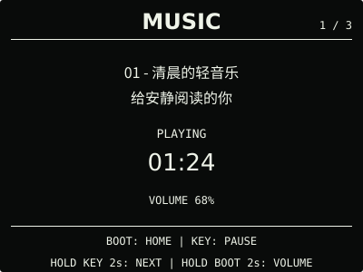

# microSD 音乐播放

本文记录 v0.27.0 候选的实现与验收安排；尚未发布，也尚未通过目标板验收。

## 使用方式

音乐存放在 FAT32 microSD 的 `rlcd/music/` 目录，与 `rlcd/images/` 分开。先关机，
通过读卡器复制 MP3，再插回设备开机；不格式化、不改动卡上的其他文件。首版不提供
歌曲下载或手机上传，也不把歌曲打包进固件。无卡或无可播放文件时隐藏音乐页。

音乐页位于日常页面环末尾，显示文件名、播放状态、播放时间和音量：

- 短按 `KEY` 播放或暂停；按住 `KEY` 2 秒选择下一首，播放中切歌继续播放；
- 短按 `BOOT` 回到时钟，音乐继续播放；按住 `BOOT` 2 秒直接调整音量；
- 音量编辑沿用短按 `KEY` 调整、按住 2 秒保存、`BOOT` 取消，不引入新按键组合；
- 正常播放按文件名顺序前进，最后一首结束后停止；不在开机、页面浏览或断电恢复时自动播放。

支持 MP3 Layer III（CBR/VBR，不支持 free-bitrate）和 16 位小端 PCM WAV，单声道或
立体声；立体声会合并到板载单扬声器。常用采样率为 8、11.025、12、16、22.05、24、32、
44.1、48 kHz。WAV 的浮点、24 位、压缩格式不在本版范围内。
最多显示 32 首，单个文件不超过 256 MiB，文件名最多 127 个 UTF-8 字节，包含扩展名；
仅扫描这一层目录，最多检查 256 个目录项。建议使用 `01 - 歌名.mp3` 这样的名称排序。
常用简体汉字可显示，不支持的字形显示为 `?`；超长名称截断。首部标签最多 1 MiB，
格式校验失败的文件不会进入列表。

屏幕只显示实际已播放时长，不把 MP3 的平均码率估算当作精确总时长或进度。
暂停后切歌会停在新选中的歌曲，需短按 KEY 开始；播放中切歌则继续播放。
因闹钟、对话、图片写入或升级停止后，再播放会从该首开头开始。

## 实现约束

- 首版支持 MP3 与受限的 16-bit PCM WAV；有界扫描目录、校验文件名与格式、限制文件数量
  和大小。中文文件名使用受支持的字体显示；超长名称按像素截断，不滚动动画；
- 音乐分块读取、解码为 PCM 后输出到现有 ES8311；与现有音频工作任务共用唯一 codec/I2S
  所有者，不另起一个直接争用扬声器的任务；
- 暂停保留本次流的位置；闹钟、对话或维护操作中断音乐时关闭文件、解码器和扬声器，
  结束后不自动恢复，明确显示已停止，由用户再次播放；
- microSD 读取与既有图片扫描、导入、删除共用存储互斥；播放期间仍可显示已经缓存的图片；
- 不更改 Flash 分区、离线语音模型、凭据布局和现有恢复模式，不自动联网。运行中换卡仍不支持；
- 解码组件固定版本、摘要与许可，保存在仓库外；按实际链接内容更新第三方声明。

## 同版交互与门户调整

- 系统页顺序改为对话、设置、在线更新、状态；普通设置入口长按 2 秒，恢复门户仍为 3 秒；
- 快捷闹钟只切换开关并保存，取消单独的编辑阶段；音量仍有明确保存与取消；
- 常用门户表单保持直接可见，天气、AI 等按需展开；各区保存不覆盖其他未保存草稿；
- 页脚显示 `© 当前年 ESP32 固件`，项目名在新页面打开 `https://mcu.taifua.com/`。
  年份使用手机时间，所有页面资源仍由设备本地提供，不依赖外网；
- 普通恢复入口、本地 OTA、API Key 不回显和危险操作确认均须保持。

## 实施与验收清单

- [x] 固定解码依赖和许可；新增有界歌曲目录、流式读取与纯逻辑测试。
- [x] 集成独占音频工作任务；主机覆盖分块输出、中断和资源回收，板上听感仍待验收。
- [x] 音乐页、设备菜单、长按提示、显示布局和文档一致。
- [x] 门户分区、草稿保护、反馈与 footer 完成，并覆盖普通/恢复门户的浏览器逻辑测试。
- [x] 主机测试、仓库与许可检查、ESP-IDF 构建通过；确认 OTA 大小、分区和模型不变。
- [x] 更新 README、CHANGELOG、效果图与 Beta 部署记录；仅发布候选到测试通道。
- [ ] 用户验证有卡/无卡、MP3/WAV、暂停/切歌/音量、后台时钟、闹钟和对话中断后，再正式发布。

主机测试 `test_music_format` 覆盖名称、MP3 帧/ID3、WAV 与截断边界；
`test_music_stream` 运行项目的真实流式读取代码，验证 WAV PCM、立体声合并、分块、取消、
分配失败与解码器释放。MP3 解码库是 Xtensa 二进制，主机测试使用自有桩验证接口边界，
不能代替 ESP32-S3 上的真实 MP3 解码和音质验证。

## 实机验收

`0.27.0-dev.1` 已于 2026-09-05 通过固定测试通道脚本发布；公网清单与 OTA 下载和
本地构建逐字节一致，清单禁止缓存、版本化 OTA 长期缓存。稳定版仍为 `0.26.0`。
设备在 Beta 通道执行 ONLINE UPDATE 即可检查安装，无需 USB 重刷模型。
部署备份编号为 `testing-20260905T073658Z-e82fc3f7712a`，服务器只改测试通道文件，
未改站点页面、稳定通道、Nginx、Docker 或其他服务。本轮未通过 USB 写入目标板。

1. 先放入 2–3 个有效文件，至少包含 MP3 和 PCM WAV，带中文名。正常开机保持时钟，
   扫描结束不抢页面；BOOT 切到 MUSIC 后仍不自动播放。
2. 短按 KEY 播放、暂停、继续，长按 2 秒下一首；提前松开不切歌、不触发播放/暂停。
   播放末首到结束后应停止，损坏文件只在音乐页提示错误，不重启、不反复弹页。
3. 音乐页长按 BOOT 调音量，测试 0%、20%、60%，保存生效，取消不改；音量编辑期间
   可继续听音乐，保存、取消和编辑超时都回到音乐页。先从较低音量开始。
4. 播放时 BOOT 返回时钟，应继续听到音乐；图片、天气和温湿度仍正常。触发闹钟、开始
   对话、进入网页设置、删除图片或执行 OTA 时，音乐停止，相关功能结束后不自动恢复。
5. 门户测试在 AI Key 输入未保存内容后保存常用设置或删除图片，输入应保留；正常保存
   AI 配置仍清空自己的 Key。天气、AI、本地升级可展开，footer 新页面打开站点。
6. 关机取卡再开机，无卡应不显示音乐页，时钟等照常工作；不可热插拔。恢复模式仍只保留
   在线更新与精简门户。长期播放的内存、栈余量和功耗另行记录，不从一次播放推断稳定性。

## 参考

- [Espressif 音频解码组件](https://components.espressif.com/components/espressif/esp_audio_codec/versions/2.6.2/readme)
- [微雪硬件资料](https://docs.waveshare.com/ESP32-S3-RLCD-4.2)
- [设备设置分工](design-guidelines.md#设置分工)
